# 核心模块详细设计文档

> 本文档详细描述系统五大核心模块的类结构、具体实现细节、活动图与时序图。
> 所有图表使用 PlantUML 语法，符合学术论文作图规范标准（黑白配色、无阴影）。

---

## 目录

1. [事件总线模块（类间接口）](#1-事件总线模块类间接口)
2. [调度策略模块](#2-调度策略模块)
3. [线程块模拟模块](#3-线程块模拟模块)
4. [栅栏算法模块](#4-栅栏算法模块)
5. [全局内存模拟模块](#5-全局内存模拟模块)

---

## 1. 事件总线模块（类间接口）

**源文件**: `src/model/event_bus.py`

### 1.1 设计目的

事件总线 (EventBus) 是系统解耦的核心枢纽，采用 **发布-订阅 (Publish-Subscribe)** 模式，使调度器、栅栏、线程块三大组件无需持有彼此的直接引用即可通信。

### 1.2 类结构

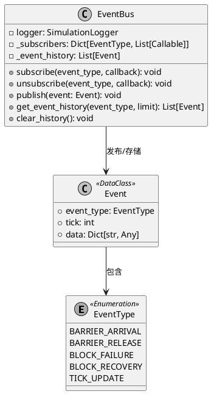

**类图说明**：
- `EventBus` 是整个事件通信的核心单例，内部维护一个 `_subscribers` 字典，将不同的 `EventType` 映射到对应的回调函数列表。
- `Event` 是一个数据类（DataClass），封装了事件发生的周期 (`tick`) 和具体数据 (`data`)，并与特定的 `EventType` 强绑定。
- 采用发布-订阅模式，使得系统的调度器（发布者）与性能监控组件（订阅者）之间实现完全的代码解耦。

### 1.3 事件类型详解

> **表释**：下表详细列举了系统中定义的所有核心事件交互规格。在本系统中，**"事件（Event）"** 是指在仿真时钟轴上发生的、具有离散状态变化的抽象数据包。**"发布者（Publisher）"** 是状态发生改变并向外广播信号的实体对象，而**"订阅者（Subscriber）"** 是指接收此信号并触发后续回调响应的接收方实体。`data` 字段则记录了单次事件所必须传递的关键载荷。

| 事件类型          | 触发时机                  | 发布者           | 订阅者          | data 字段                 |
| ----------------- | ------------------------- | ---------------- | --------------- | ------------------------- |
| `BARRIER_ARRIVAL` | Block 到达同步点          | Scheduler        | SimulationModel | `{block_id, barrier_id}`  |
| `BARRIER_RELEASE` | 所有 Block 到齐，栅栏释放 | SimulationModel  | Scheduler       | `{block_ids, barrier_id}` |
| `BLOCK_FAILURE`   | Block 超时或故障          | FailureScheduler | —               | `{block_id, reason}`      |
| `BLOCK_RECOVERY`  | Block 从故障恢复（预留）  | —                | —               | `{block_id}`              |
| `TICK_UPDATE`     | 时钟前进（预留）          | —                | —               | `{}`                      |

### 1.4 辅助工厂函数

> **表释**：下表汇总了系统中用于事件对象创建的工程接口。在面向对象设计中，**"辅助工厂函数（Helper Factory Function）"** 是一种创建型设计模式的具体应用。它将具有固定结构的 `Event` 对象的装配过程（即：系统时间戳和标准化字典数据的拼装）从核心业务流中剥离，使得调用方仅需传入必要的标量参数即可获取实例，极大程度地降低了模块构造的耦合度。

| 函数                                                        | 用途         |
| ----------------------------------------------------------- | ------------ |
| `create_barrier_arrival_event(tick, block_id, barrier_id)`  | 创建到达事件 |
| `create_barrier_release_event(tick, block_ids, barrier_id)` | 创建释放事件 |
| `create_block_failure_event(tick, block_id, reason)`        | 创建故障事件 |
| `create_tick_update_event(tick)`                            | 创建时钟事件 |

### 1.5 关键实现细节

1. **历史记录上限**: `_event_history` 最多保留 1000 条，超出后 FIFO 淘汰，防止内存泄漏。
2. **安全回调**: `publish()` 在遍历订阅者前复制列表 (`subscribers[:]`)，防止回调中修改订阅导致迭代异常。
3. **异常隔离**: 单个回调抛出异常不会影响其他订阅者，异常被捕获并记录到日志。

### 1.6 活动图：事件发布流程

> **图释**：该图展示了事件总线的发布方法处理事件订阅与回调执行的完整流程。首先将事件追加到历史记录并检查上限，然后复制订阅者列表并遍历执行回调，对异常进行捕获与日志记录。

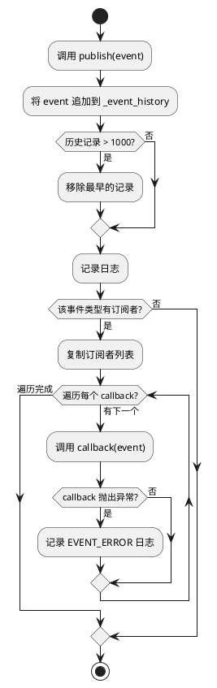

### 1.7 时序图：跨模块通信流程

> **图释**：该图展示了 Block 到达同步点后，Scheduler、EventBus、SimulationModel、Barrier 之间的消息传递顺序。包括 `publish(BARRIER_ARRIVAL)`、`on_barrier_arrival`、`barrier.arrive` 等核心消息，以及 `release_all` 与 `BARRIER_RELEASE` 的条件触发路径。

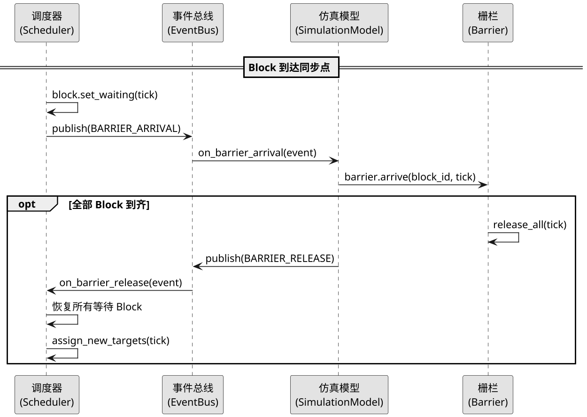

---

## 2. 调度策略模块

**源文件**: `src/model/schedulers/scheduler.py`, `normal_scheduler.py`, `failure_scheduler.py`

### 2.1 设计目的

调度器负责驱动线程块 (Block) 的执行进度，决定每个 Block 何时到达同步点。采用 **策略模式 (Strategy Pattern)**，通过 `SimulationModel` 根据配置动态选择具体调度器。

### 2.2 类结构

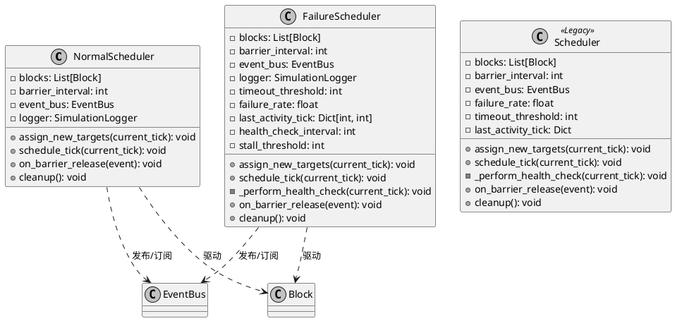

**类图说明**：
- 调度器模块采用了**策略模式**，剥离出 `NormalScheduler`（专注常规调度）和 `FailureScheduler`（增加容错与健康检查功能）两个具体实现。
- `Scheduler` 类标记为 `<<Legacy>>`，表示它是系统重构前遗留的历史合并版本代码，目前已被分离的两大新调度器取代。
- 所有调度器都与 `EventBus` 和 `Block` 产生依赖关联：它们驱动 `Block` 的状态跃迁，并通过 `EventBus` 对外广播关键生命周期事件。

> **注**: `Scheduler` 是早期遗留的合并版本，`NormalScheduler` 和 `FailureScheduler` 是重构后的清晰分离版本。`SimulationModel` 根据 `simulation_mode` 配置选择使用后两者之一。

### 2.3 调度器对比

> **表释**：下表对比展示了两种不同约束环境下的调度策略体系能力差异。主要评估指标释义如下：**"随机工作量"** 旨在描述系统依据方差参数自动扰动运行时态，用以复刻物理硬件分配的非一致性波动；**"故障注入（Fault Injection）"** 属于高可靠性软件容错领域的标准测试手段，指故意向集群引入异常失联以论证防塌陷能力；**"健康检查"** 功能则属于旁路诊断环，用于周期性探测死锁停滞的安全下限。

| 特性       | NormalScheduler               | FailureScheduler                             |
| ---------- | ----------------------------- | -------------------------------------------- |
| 随机工作量 | ✅ 由 `workload_variance` 控制 | ✅ 由 `workload_variance` 控制                |
| 故障注入   | ❌                             | ✅ 按 `failure_rate` 概率注入                 |
| 超时检测   | ❌                             | ✅ 等待超过 `timeout_threshold` 则 FAILED     |
| 健康检查   | ❌                             | ✅ 每 100 tick 检查一次，停滞 > 200 tick 告警 |
| 活动追踪   | ❌                             | ✅ `last_activity_tick` 字典                  |

### 2.4 核心方法详解

#### `assign_new_targets(current_tick)`

为每个活跃 Block 分配下一个同步阶段的目标 tick：调度器根据基准间隔和随机方差计算每个线程块的预计执行时长，方差越大则各线程块的工作量差异越大，能够更真实地模拟硬件资源分配的不均匀性。具体实现为：从配置中获取线程块的方差参数，生成一个在正负方差范围内的随机偏移量，将该偏移量应用到基准间隔上，计算出当前线程块到达同步点的目标时间戳，并调用线程块的阶段目标设置方法保存这些参数。

#### `schedule_tick(current_tick)`

每个时钟周期的调度逻辑入口。对每个 Block 执行以下操作：首先（仅在 FailureScheduler 模式下）对运行中的线程块按配置的故障率进行随机故障注入；其次推进线程块的工作进度并更新活动记录；然后判断当前时间是否已达到该线程块的阶段目标，若达到则令其进入等待状态并发布到达事件；接着（仅在 FailureScheduler 模式下）检查等待中的线程块是否超时；最后（仅在 FailureScheduler 模式下）执行周期性健康检查以探测死锁风险。

### 2.5 活动图：FailureScheduler 单 Tick 调度

> **图释**：该图展示了故障调度器在每个时钟周期内的完整调度流程。分为三个阶段：故障注入阶段对运行中的线程块按概率注入失联故障；工作推进阶段更新线程块进度并触发等待；超时检测阶段判定等待线程块是否超时。

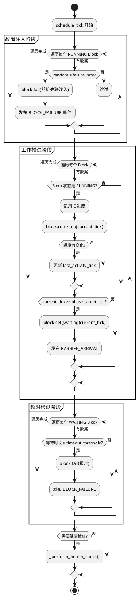

### 2.6 活动图：栅栏释放响应

> **图释**：该图展示了调度器收到栅栏释放事件后的响应流程。根据事件中的线程块列表是否为空，决定恢复所有等待线程块或仅恢复指定线程块，然后分配下一阶段的执行目标。

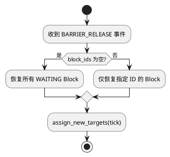

### 2.7 时序图：调度器与栅栏交互

> **图释**：该图展示了单个线程块到达同步点时与栅栏的交互时序。调度器发布到达事件后，仿真模型调用栅栏到达方法；当所有线程块到齐时触发释放，调度器恢复等待的线程块并分配新的执行目标。

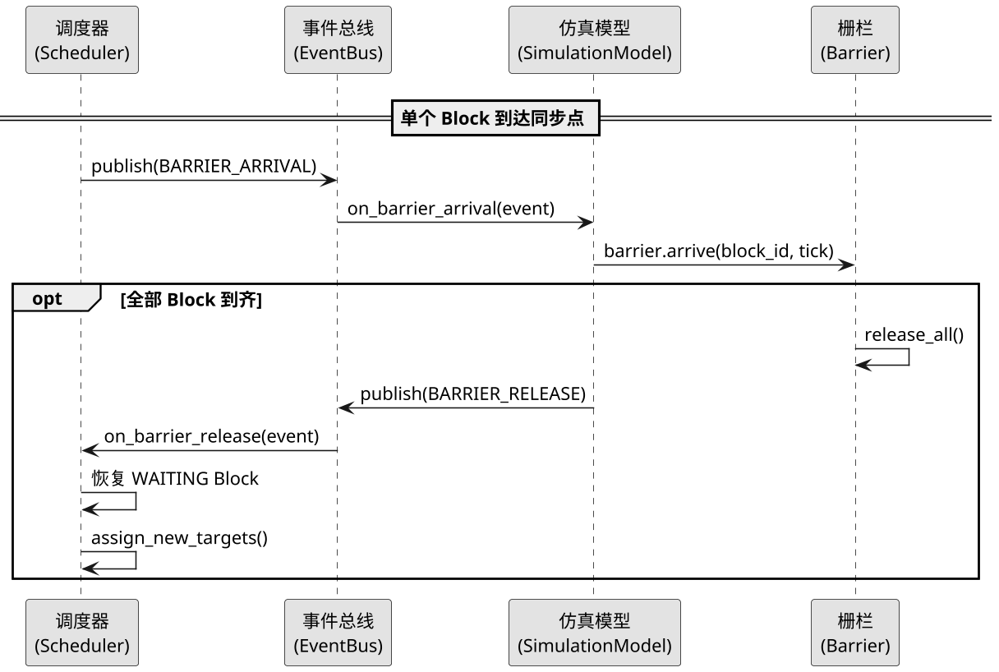

---

## 3. 线程块模拟模块

**源文件**: `src/model/block.py`

### 3.1 设计目的

Block 类表示 GPU 中的一个线程块 (Thread Block)，是最基本的执行单元。该类与 Barrier 类无直接引用关系，由 Scheduler 外部驱动状态转换。

### 3.2 类结构

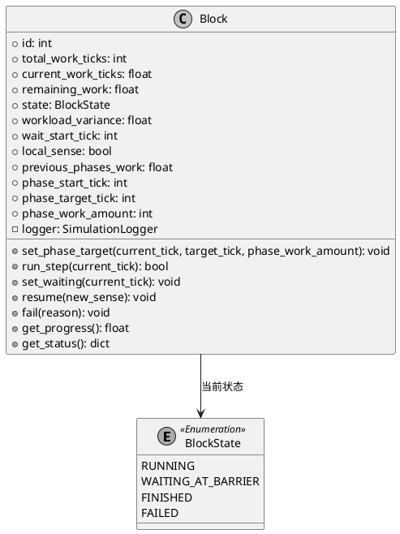

**类图说明**：
- `Block` 类负责维护单个 GPU 线程块的核心执行上下文，包括总工作量 (`total_work_ticks`)、阶段剩余工作量 (`remaining_work`) 等。
- 它强依赖于枚举类 `BlockState` 来标识当前的执行纪元（RUNNING / WAITING_AT_BARRIER / FINISHED / FAILED）。
- `run_step()` 和 `set_waiting()` 等对外暴露的接口方法构成了被外部调度器驱动的基础动作元语义。

### 3.3 状态机

> **图释**：该图展示了线程块的四种状态及其转换条件。运行状态可转为等待栅栏、完成或失败；等待状态可被栅栏释放恢复运行，或因超时转为失败；完成和失败状态为终态。

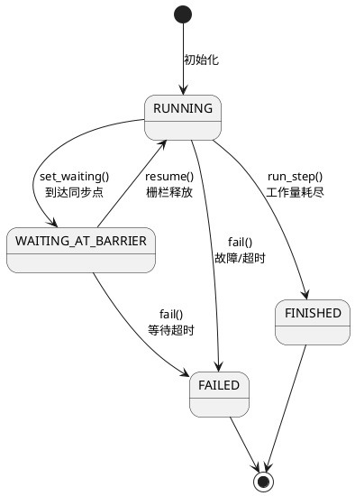

### 3.4 核心方法详解

#### `set_phase_target(current_tick, target_tick, phase_work_amount)`

设定当前同步阶段的时间窗口。每次栅栏释放后由 Scheduler 调用。方法首先将当前已完成的工作量保存为历史累计值，然后记录本阶段的起始时间戳、预期到达同步点的时间戳以及本阶段计划完成的工作量。这些参数共同定义了线程块在当前同步周期内的执行范围。

#### `run_step(current_tick)`

基于线性插值计算当前阶段的工作进度：方法根据当前时间戳相对于阶段起始和目标时间的比例，计算出当前阶段已完成的工作量，再加上前几个阶段的累计工作量，得出线程块的总工作进度。当剩余工作量耗尽且进度比例达到 100% 时，线程块状态转入完成状态。

#### `set_waiting(current_tick)`

仅在运行状态下可调用，用于记录线程块开始等待同步点的时间戳。等待开始时间用于后续的超时检测逻辑，当线程块等待时长超过配置的阈值时将被判定为超时失败。

#### `resume(new_sense=None)`

仅在等待栅栏状态下有效，用于恢复线程块为运行状态。可选地接收并更新本地 sense 标志，该标志用于 sense-reversal 算法的释放检测机制，线程块通过比较本地 sense 与全局 sense 来判断是否收到释放信号。

### 3.6 时序图：Block 状态转换生命周期

> **图释**：该图展示了线程块在调度器驱动下的完整状态变化周期。调度器分配阶段目标后，线程块持续执行并计算进度，到达同步点时进入等待状态，栅栏释放后恢复运行并分配新的阶段目标。

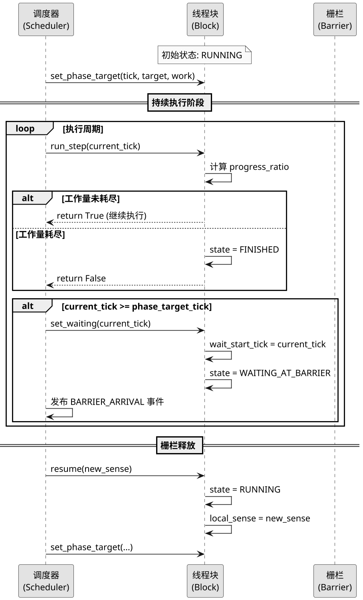

---

## 4. 栅栏算法模块

**源文件**: `src/model/barrier.py` (抽象基类), `src/model/barriers/` (具体实现)

### 4.1 设计目的

栅栏 (Barrier) 是同步机制的核心，确保所有线程块到达同步点后才统一释放。系统采用 **模板方法模式 (Template Method)**—— 基类 `Barrier` 定义了模拟原子指令的通用接口和内存追踪，各子类只需实现具体的同步算法。

### 4.2 类继承结构

> **图释**：该图展示了栅栏基类与三种具体栅栏实现的继承关系。集中式栅栏使用单一计数器，树形栅栏使用链表节点构建二叉树，静态树栅栏使用数组索引实现完全二叉树。三者均持有性能指标统计对象。

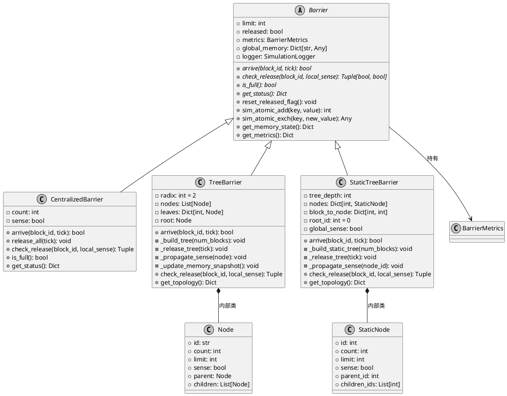

**类图说明**：
- 本模块运用了**模板方法模式**，抽象基类 `Barrier` 定义了四个纯虚方法 (`arrive`, `check_release`, `is_full`, `get_status`)，并统一实现了模拟原子指令的逻辑（`sim_atomic_add`, `sim_atomic_exch`）。
- `CentralizedBarrier` 使用极简单体结构；`TreeBarrier` 依赖动态的链表 `Node` 内部类构建聚合拓扑；`StaticTreeBarrier` 采用基于数组计算的 `StaticNode`。
- 所有算法变体在生命周期内都统一持有一个 `BarrierMetrics` 实例，负责在通信流转过程中无感沉淀性能基准数据。

### 4.3 三种算法对比

> **表释**：下表横向梳理了仿真平台实现的三种不同维度空间同步算法的架构边界特征及理论瓶颈上限。其中核心名词与复杂度度量定义为：**"到达复杂度"与"释放复杂度"** 分别指明单个计算块在网络通信中所须承受的不可分解操作调用次数，它反映出算法整体的渐近效率瓶颈；而**"寻址方式（Addressing Mode）"** 明确规定了同步链路沿物理内存游移时，是优先选择链式指针寻址（Pointer Linked）抑制资源浪费，还是阵列公式寻址（Array Indexing）换取寄存器级命中率的设计偏好。

| 维度           | CentralizedBarrier    | TreeBarrier                    | StaticTreeBarrier            |
| -------------- | --------------------- | ------------------------------ | ---------------------------- |
| **数据结构**   | 单计数器 + sense 标志 | 链表式节点对象                 | 数组索引完全二叉树           |
| **存储方式**   | `{counter, sense}`    | `{node_X.count, node_X.sense}` | `{nodeN.count, nodeN.sense}` |
| **到达复杂度** | O(1) 原子操作         | O(log n) 逐层向上              | O(log n) 逐层向上            |
| **释放方式**   | 直接翻转 sense        | 根节点翻转 + 递归传播          | 根节点翻转 + 递归传播        |
| **释放复杂度** | O(1)                  | O(n) 广播                      | O(n) 广播                    |
| **内存节点**   | 2 个变量              | 2 × (内部节点 + 叶子)          | 2 × (2n-1) 个数组元素        |
| **寻址方式**   | —                     | 指针 (`node.parent`)           | 数学公式 (`(i-1)/2`)         |
| **拓扑可视化** | 星型                  | CSS 树 + 邻接表                | CSS 树 + 数组索引            |

### 4.4 CentralizedBarrier 实现

CentralizedBarrier 采用集中式计数策略，所有 Block 共享一个全局计数器。全局内存仅需两个变量即可完成同步功能：计数器记录已到达的线程块数量，sense 标志用于标识当前同步周期的释放状态。

**全局内存布局**：存储两个键值对，其中"counter"键保存当前到达的线程块计数，"sense"键保存sense标志的当前值（0或1）。

**arrive 流程**：线程块到达时首先触发原子加法操作使计数器递增，然后检查计数器值是否达到线程块总数上限。若达到上限则说明自己是最后到达者，应触发释放操作。释放操作通过原子交换指令将计数器重置为零，并将sense标志翻转，从而向所有等待线程块发出释放信号。

### 4.5 TreeBarrier 实现

使用链表式节点对象构建二叉树，叶子节点与 Block 关联。相比集中式策略，树形结构将计数器分散到多个节点，降低了单个原子操作的竞争压力。

**树构建流程**：首先根据线程块数量和固定分叉数（radix=2）计算所需的叶子节点数，然后创建叶子节点并建立与各线程块的映射关系，接着自底向上逐层创建父节点并建立父子指针链接，最后直到只剩下一个根节点时树构建完成。

**arrive 流程**：线程块到达时首先定位其关联的叶子节点，在该节点上执行原子递增操作。若该节点计数达到上限，说明该节点所管理的所有线程块均已到达，此时重置该节点计数并向其父节点传播信号。信号沿树结构逐层向上传播，直到抵达根节点后触发全树释放。释放时根节点翻转sense标志，然后递归地将sense值广播到所有子节点，确保所有线程块收到一致的释放信号。

### 4.6 StaticTreeBarrier 实现

使用数组索引构建完全二叉树，无指针开销。该实现将树的拓扑关系完全编码为数学公式，无需显式存储父子指针，从而减少内存占用并提高缓存局部性。

**树构建流程**：首先根据线程块数量计算树中节点总数（总节点数等于两倍的线程块数减一），然后为每个节点预分配计数器与sense标志。节点间的父子关系完全通过索引计算得出，无需额外指针存储。每个线程块通过固定的偏移计算映射到对应的叶子节点索引。

**节点寻址公式**：对于索引为 i 的节点，其左子节点索引为 2i+1，右子节点索引为 2i+2，父节点索引为 (i-1)除以2向下取整。叶子节点起始于总节点数减去线程块数量的索引位置。通过这些公式，可以从任意节点计算出其所有关联节点的位置。

**arrive 流程**：与树形栅栏逻辑相同，区别在于使用数学公式计算父节点索引而非通过指针跳转。当计数达标需要向上传播时，只需计算父节点索引即可定位到目标节点，无需遍历链表结构。

### 4.7 活动图：TreeBarrier / StaticTreeBarrier 的 arrive 流程

> **图释**：该图展示了树形栅栏的到达处理流程。首先验证线程块有效性，然后在叶子节点递增计数；若计数达标则向父节点传播直至根节点，根节点触发释放并翻转标志位；若未达标则停止传播并更新内存快照。

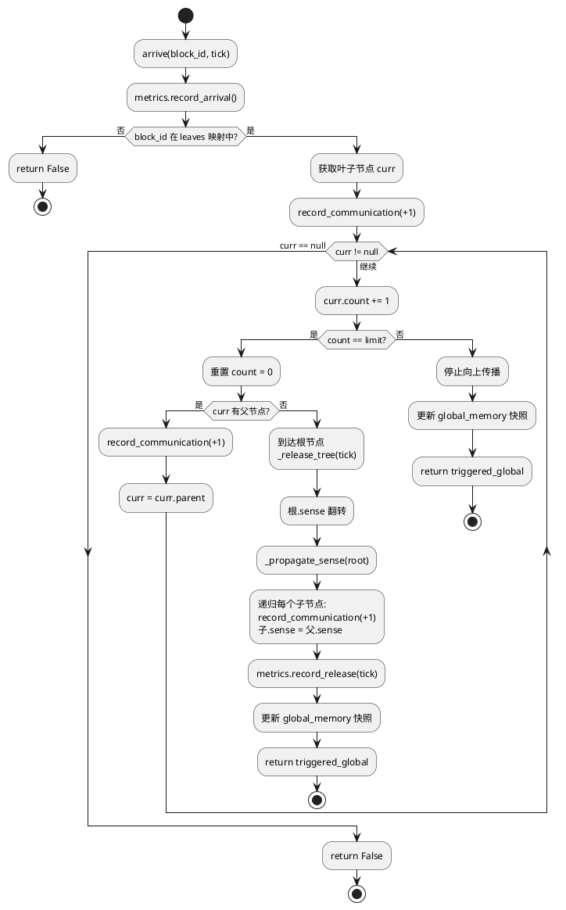

### 4.9 时序图：CentralizedBarrier 完整同步周期

> **图释**：该图展示了 3 个线程块（limit=3）依次到达集中式栅栏并触发释放的完整时序。核心机制为：每个 Block 到达时对全局内存中的 `counter` 执行一次原子加 1；当最后一个 Block 使 `counter` 达到 `limit` 时，栅栏将 `counter` 重置为 0、翻转 `sense` 标志位，并标记释放完成。

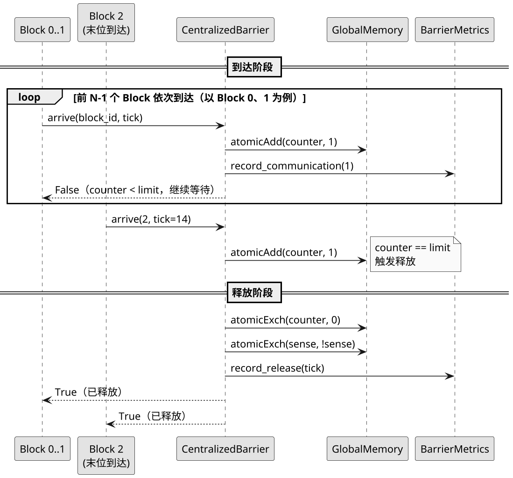

### 4.10 时序图：TreeBarrier 树形传播

> **图释**：该图以 4 个线程块为例，展示树形栅栏的**两阶段传播**过程。树结构为：根节点 Root 下有两个叶子节点 Leaf0 和 Leaf1，Block 0/1 绑定到 Leaf0，Block 2/3 绑定到 Leaf1。**到达阶段（自底向上）**：每个 Block 到达时对其所属叶子节点的 `count` 原子累加；当叶子节点收齐后，向父节点（Root）传播；Root 也收齐后触发释放。**释放阶段（自顶向下）**：Root 翻转自身 `sense`，然后通过 `_propagate_sense()` 递归向下将新 sense 值广播到所有子节点，最终写入全局内存。

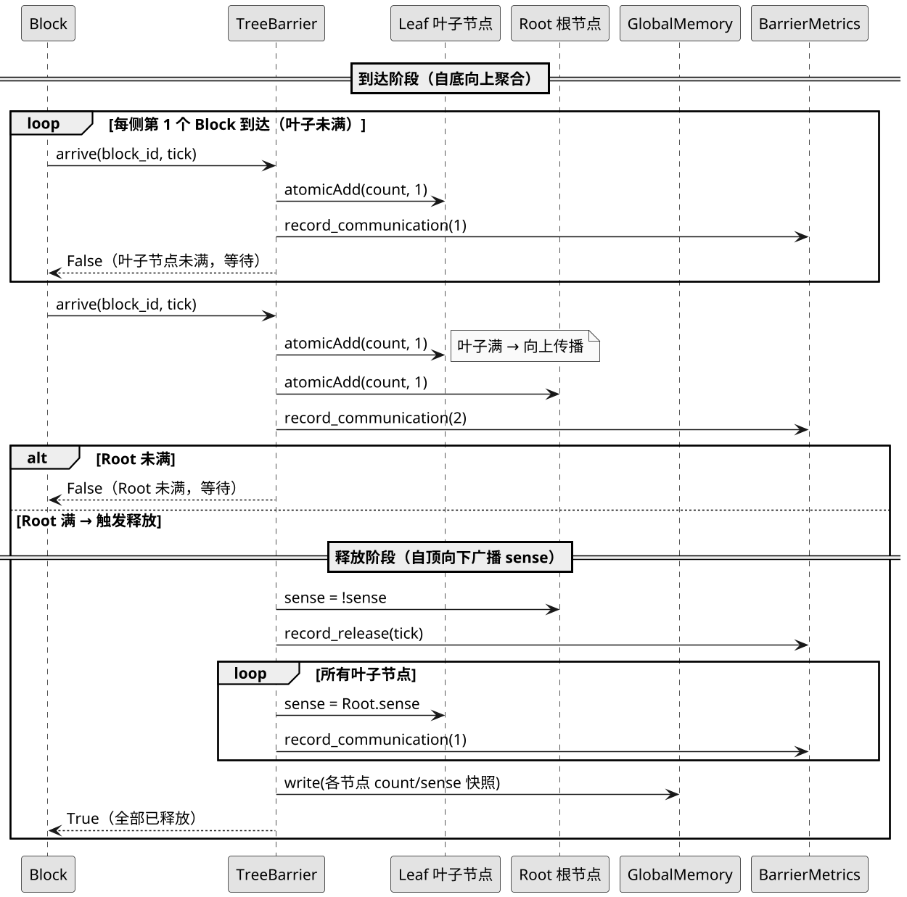

---

## 5. 全局内存模拟模块

**源文件**: `src/model/barrier.py` (原子指令接口), `src/model/barrier_metrics.py` (指标收集)

### 5.1 设计目的

在真实 GPU 中，栅栏同步依赖全局显存 (Global Memory) 中的共享变量和硬件原子指令。本模块在仿真层面模拟这一机制：

1. **全局内存** (`global_memory`): 每个 Barrier 实例持有一个 `Dict[str, Any]`，模拟 GPU 全局显存中的共享变量。
2. **原子指令**: `sim_atomic_add()` 和 `sim_atomic_exch()` 模拟 CUDA 的 `atomicAdd` 和 `atomicExch`，保证读-改-写的不可分割性。
3. **通信计量**: 每次原子操作自动记录一次通信事件，用于统计通信开销指标。

### 5.2 类结构

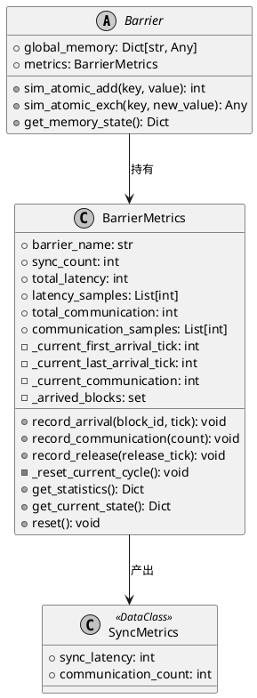

**类图说明**：
- 在仿真架构中，`global_memory` 字典被封装在 `Barrier` 基类内部，作为被动存储介质。
- `sim_atomic_add` 等核心方法挂载在 `Barrier` 上，代表底层 SM（流式多处理器）对全局内存发起的主动原子修改。
- 每次发生原子读写，都会触发与其生命周期绑定的 `BarrierMetrics` 收集器进行计数（`record_communication`），最终在同步周期结束时打包沉淀为不可变的 `SyncMetrics` 数据块。

### 5.3 原子指令映射

> **表释**：下表罗列了基于高级语言抽象搭建的宏观仿真框架连接底层硬件微指令集的等价映射准则。在此上下文中，**"原子指令（Atomic Instruction）"** 作为一个计算机体系结构概念，专指在多核并发竞争显存的极短周期内，锁定内存总线因而无法被挂起且绝不产生竞态条件的不可分割读写序列。**"CUDA 等价指令"** 则确切指向英伟达（NVIDIA）物理线程块攫取全局存储同步权限的核心固件原语。

| 仿真方法                          | CUDA 等价指令                      | 语义                             | 返回值             |
| --------------------------------- | ---------------------------------- | -------------------------------- | ------------------ |
| `sim_atomic_add(key, value)`      | `atomicAdd(&mem[key], value)`      | 原子加法: `mem[key] += value`    | 修改前的旧值 (old) |
| `sim_atomic_exch(key, new_value)` | `atomicExch(&mem[key], new_value)` | 原子交换: `mem[key] = new_value` | 修改前的旧值 (old) |

两个方法的实现逻辑相同：首先读取全局内存中指定键的当前值（若不存在则默认为0），然后执行修改操作（加法或赋值），最后返回修改前的旧值。每次原子操作完成后自动调用性能指标记录方法，将通信开销累加到统计计数器中。

### 5.4 各算法的全局内存布局

> **说明**：全局内存是栅栏状态的存储载体，以键值对形式模拟 GPU 全局显存中的共享变量，每个栅栏算法有不同的内存布局结构。

#### CentralizedBarrier

全局内存仅需两个键值对即可完成同步功能。"counter"键保存当前已到达栅栏的线程块累计数量，"sense"键保存sense标志的当前状态（0或1），用于标识当前同步周期是否已释放。

#### TreeBarrier

全局内存为树中的每个节点保存一对计数器与sense标志。键的命名格式为"node_节点标识.count"和"node_节点标识.sense"，其中节点标识遵循从上到下、从左到右的编号顺序。叶子节点与线程块直接关联，内部节点负责汇总子节点的到达状态。

#### StaticTreeBarrier

全局内存同样为每个节点保存计数器与sense标志，但采用连续的数组索引命名格式。键的命名格式为"node数组索引.count"和"node数组索引.sense"，根节点索引为0，其左右子节点索引分别为1和2，依此类推。数组中所有元素的位置关系完全由索引决定，无需额外存储拓扑信息。

### 5.5 性能指标收集 (BarrierMetrics)

BarrierMetrics 只追踪两个核心指标：

1. **同步延迟 (Sync Latency)**: `release_tick - last_arrival_tick`，即最后一个 Block 到达到栅栏释放的时间差。
2. **通信开销 (Communication Overhead)**: 一个同步周期内所有原子操作的总次数。

> **图释**：该图展示了性能指标的四个核心方法之间的调用顺序与数据流向。记录到达方法收集线程块到达时间，通信记录方法累加通信次数，释放记录方法计算同步延迟并归档，清空方法重置临时数据，形成完整的环形生命周期。

#### 收集生命周期：

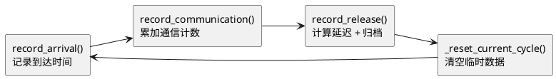

### 5.6 活动图：BarrierMetrics 完整收集周期

> **图释**：该图展示了性能指标在一个同步周期内的完整收集流程。线程块依次到达时记录到达时间并更新已到达集合，最后到达者触发释放时计算同步延迟，然后清空临时数据等待下一周期。

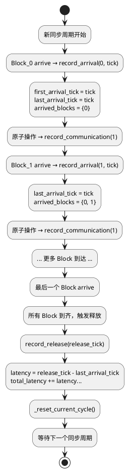

### 5.7 时序图：原子指令执行与指标收集

> **图释**：该图展示了原子指令执行与指标收集的交互过程。栅栏调用原子加法操作操作全局内存中的共享变量，每次原子操作自动记录一次通信事件；同步周期完成时将计算的同步延迟返回给栅栏。

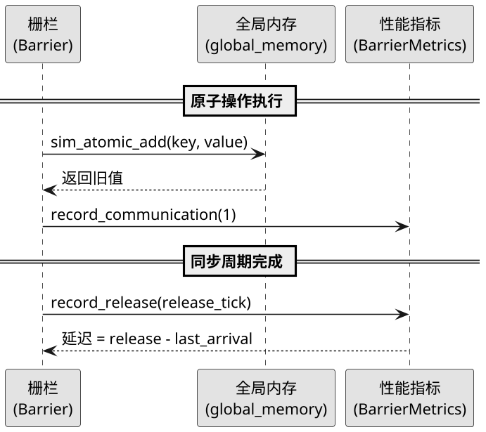

### 5.8 前端展示

全局内存状态通过 `/api/state` 接口返回，前端以两种方式展示：

1. **热力表格** (所有算法): 变量名 → 值 → 热度颜色
   - 蓝色 (`#93c5fd`): 值为 0
   - 深蓝 (`#3b82f6`): 强度 < 0.3
   - 橙色 (`#f59e0b`): 强度 0.3 ~ 0.7
   - 红色 (`#ef4444`): 强度 > 0.7

2. **存储结构面板** (树形/静态树):
   - TreeBarrier → 邻接表 (Adjacency List) 形式
   - StaticTreeBarrier → 数组索引 (Array Indexing) 形式，附带层级划分说明

---

## 附录：模块间关系总览

> **图释**：该图展示了系统五大模块间的静态依赖关系与事件流方向。仿真模型协调各模块工作，调度器驱动线程块执行并发布事件，事件总线路由到达与释放事件，栅栏算法操作全局内存并统计性能指标。

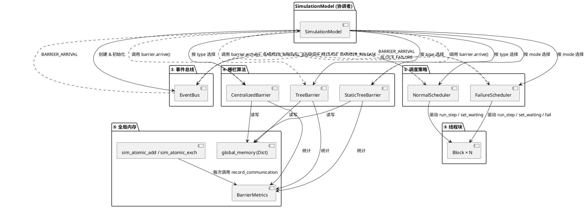
