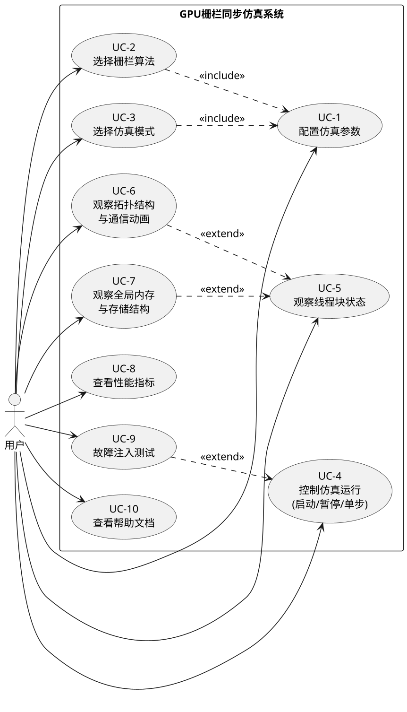
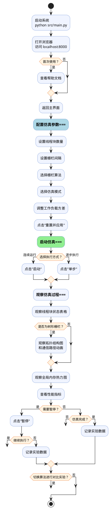
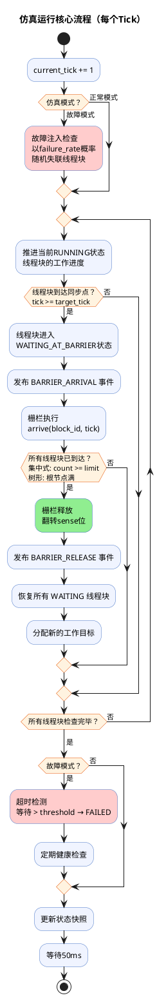
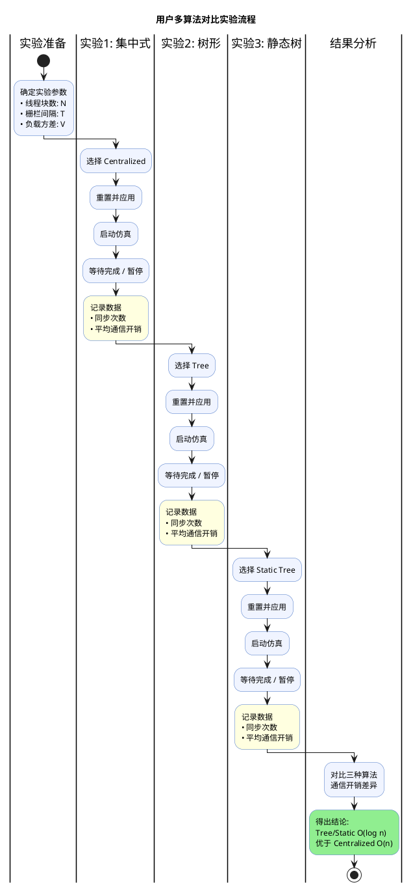

# 第3章 系统需求分析

---

## 3.1 系统概述

### 3.1.1 项目背景

GPU（图形处理器）凭借大规模并行计算能力已成为高性能计算的核心工具。在GPU编程模型中，线程块（Thread Block）之间需要通过栅栏（Barrier）机制进行同步协调。然而，真实GPU硬件对研究人员来说是"黑盒"，难以直接观察线程块间的同步过程。

本项目旨在开发一个GPU栅栏同步仿真系统，通过软件模拟和可视化手段，帮助高校师生和科研人员直观理解不同栅栏算法的工作原理和性能差异。

### 3.1.2 系统边界

本系统是一个**单机部署的Web应用**，运行于用户本地计算机上。系统边界如下图所示：

```
┌─ ─ ─ ─ ─ ─ ─ ─ ─ ─ ─ ─ ─ ─ ─ ─ ─ ─ ─ ─ ─ ─ ─ ─ ─ ─ ─ ─ ─ ─┐
│                        系统边界                                    │
│                                                                   │
│    ┌─────────────────────┐        ┌─────────────────────┐        │
│    │   后端仿真引擎       │◄──────►│   前端Web界面        │        │
│    │   (Python Server)   │  HTTP  │   (浏览器)           │        │
│    └─────────────────────┘        └─────────────────────┘        │
│               │                                                   │
│               ▼                                                   │
│    ┌─────────────────────┐                                       │
│    │   配置文件 / 日志     │                                       │
│    └─────────────────────┘                                       │
│                                                                   │
└─ ─ ─ ─ ─ ─ ─ ─ ─ ─ ─ ─ ─ ─ ─ ─ ─ ─ ─ ─ ─ ─ ─ ─ ─ ─ ─ ─ ─ ─┘
         ▲                                     ▲
         │                                     │
    ┌────┴────┐                           ┌────┴────┐
    │  配置文件 │                           │  用户    │
    │ (JSON)  │                           │         │
    └─────────┘                           └─────────┘
```

### 3.1.3 用户角色识别

通过需求调研，识别出表 3-1 所列的三类用户角色。三类角色在系统交互层面的操作完全一致，因此在后续用例分析中统一抽象为"用户（User）"这一参与者。

**表 3-1：用户角色识别**

| 角色 | 描述 | 典型场景 |
|------|------|---------|
| **教师** | 高校并行计算课程讲授者 | 课堂演示不同栅栏算法的工作原理和性能差异 |
| **学生** | 并行计算课程学习者 | 通过可视化界面学习理解栅栏同步机制 |
| **科研人员** | 研究并行同步算法的研究者 | 对比分析不同算法的通信开销和扩展性 |

---

## 3.2 可行性分析

### 3.2.1 技术可行性

表 3-2 列出了系统各技术环节的选型方案及其成熟度评估。所有技术均基于成熟标准，技术风险极低，完全可行。

**表 3-2：技术可行性分析**

| 技术环节 | 选型方案 | 成熟度 | 可行性说明 |
|---------|---------|--------|-----------|
| 仿真引擎 | Python 3.7+ 标准库 | 高 | `enum`、`dataclass`、`abc`等模块支持事件驱动仿真模型 |
| Web服务器 | Python `http.server` | 高 | 标准库模块，无需外部依赖 |
| 前端界面 | HTML5 + CSS3 + JavaScript | 高 | 原生Web技术，无需构建工具链 |
| 前后端通信 | RESTful HTTP + JSON | 高 | 成熟通信方案，跨平台兼容 |

### 3.2.2 经济可行性

- **开发成本**：仅依赖Python标准库和Web标准技术，无商业许可费用。
- **运行成本**：本地部署，普通PC即可运行，无需云服务器。
- **维护成本**：代码总量约4500行，MVC分层架构便于维护。

> **结论**：开发运行成本极低，完全可行。

### 3.2.3 操作可行性

- 安装 Python 3.7+ 后一条命令启动：`python src/main.py`
- 浏览器访问 `http://localhost:8000` 即可使用
- 内置中文帮助文档，学习门槛低

> **结论**：操作简便、用户友好，完全可行。

---

## 3.3 用户需求分析

### 3.3.1 用户故事列表

从用户视角出发，采用用户故事（User Story）格式描述需求：

编号	用户故事	优先级	验收标准
US-1	作为教师，我希望选择不同的栅栏算法，以便在课堂上对比演示各算法的工作方式	高	可在下拉框中选择集中式、树形、静态树三种算法并成功运行
US-2	作为学生，我希望观察线程块的实时状态变化，以便理解栅栏同步是如何让线程块等待和恢复的	高	状态表格实时刷新，以不同颜色标签区分运行/等待/完成/失败
US-3	作为学生，我希望看到树形栅栏的拓扑结构图，以便理解同步信号如何沿树传播	高	树形/静态树栅栏时显示可视化树状图，集中式时自动隐藏
US-4	作为教师，我希望能单步执行仿真，以便在课堂上逐步讲解每一步发生了什么	高	每次点击"单步"只前进一个时钟周期
US-5	作为学生，我希望调整线程块数量和工作负载方差，以便了解不同规模和负载模式下的算法表现	高	线程块数量可调，工作量方差可调
US-6	作为学生，我希望查看通信开销等性能指标，以便量化比较不同算法的效率	中	显示同步次数和平均通信开销并实时更新
US-7	作为教师，我希望开启故障模式演示线程块失联场景，以便讲解栅栏的容错问题	中	故障模式下随机锁死线程块，状态显示为红色"已失败"
US-8	作为学生，我希望查看帮助文档了解系统的使用方法	低	点击"帮助"链接打开说明页面
US-9	作为学生，我希望查看不同栅栏算法的内存存储结构差异	中	Tree显示邻接表格式，Static Tree显示数组索引格式
US-10	作为学生，我希望看到线程块到达栅栏时的通信动画，以便直观感受同步信号传递过程	中	叶子节点到父节点链接以橙色脉冲高亮
US-11	作为学生，我希望看到全局内存的访问热度，以便理解哪些内存位置被频繁访问	中	以不同颜色编码展示内存变量的被访问程度

### 3.3.2 用户故事地图

将用户故事按**用户活动（Activity）→ 用户任务（Task）→ 用户故事（Story）**三层组织为故事地图，并按迭代版本划分交付优先级：

**用户活动与任务层**：

| 用户活动 | 准备仿真环境 | 运行与观察仿真 | 分析与总结 |
|---------|-------------|--------------|-----------|
| 用户任务 | 1. 设定参数<br>2. 选择算法和模式 | 3. 控制仿真执行<br>4. 观察线程块行为<br>5. 观察同步过程 | 6. 查看性能指标<br>7. 对比不同算法 |

**用户故事层（按迭代版本划分）**：

| 迭代版本 | 准备仿真环境 | 运行与观察仿真 | 分析与总结 |
|---------|-------------|--------------|-----------|
| **Release 1**<br>核心MVP | US-05 调整线程块数量和工作方差<br>US-01 选择栅栏算法 | US-04 单步执行<br>US-02 观察块状态变化 | US-06 性能指标 |
| **Release 2**<br>可视化增强 | US-07 开启故障模式 | US-03 查看拓扑结构<br>US-11 内存访问热度<br>US-10 通信路径动画 | US-09 内存存储结构对比 |
| **Release 3**<br>体验优化 | — | US-08 帮助文档 | — |

---

## 3.4 用例分析

### 3.4.1 用例图

系统共包含10个核心用例，涵盖了从参数配置、运行控制到状态和性能监控的完整流程。



**用例图说明**：

系统用例按功能职责划分为三大类：

| 大类 | 包含用例 | 职责说明 |
|------|---------|---------|
| **配置仿真参数** | UC-1 配置仿真参数<br>UC-2 选择栅栏算法<br>UC-3 选择仿真模式 | 负责仿真运行前的参数设定与环境准备 |
| **控制仿真执行** | UC-4 控制仿真运行<br>UC-9 故障注入测试<br>UC-10 查看帮助文档 | 负责仿真的启动、暂停、单步等执行控制 |
| **查看仿真结果** | UC-5 观察线程块状态<br>UC-6 观察拓扑结构与通信动画<br>UC-7 观察全局内存与存储结构<br>UC-8 查看性能指标 | 负责仿真过程中的实时可视化与数据展示 |

**用例间关系**：

- UC-2（选择栅栏算法）和 UC-3（选择仿真模式）**包含（include）** UC-1（配置仿真参数），因为选择算法和模式是参数配置的组成部分
- UC-9（故障注入测试）**扩展（extend）** UC-4（控制仿真），仅在选择"失联模式"时激活
- UC-6（拓扑结构与通信动画）和 UC-7（全局内存与存储结构）**扩展（extend）** UC-5（观察线程块状态），作为状态观察的增强可视化

### 3.4.2 用例规约表

**用例设计背景**：
- **为什么有这个用例**：仿真系统的首要目标是允许用户探索不同参数空间。如果没有动态配置功能，系统将退化为静态的死模型。
- **为什么用例是这样**：设计为在统一面板集中设置参数并一键应用，旨在模拟“配置-加载-运行”的标准科研工作流，确保参数变更前完成充分确认，避免热修改导致的系统状态不一致。

#### UC-1: 配置仿真参数

用户故事US-05指出，科研人员需要"调整线程块数量和工作负载方差，以便研究不同规模和负载模式下的算法表现"，这要求系统必须提供仿真参数配置能力，因为GPU栅栏同步算法的性能表现与线程块数量、工作负载分布等参数密切相关，不同规模的并行度和负载均衡程度会直接影响同步的延迟和通信开销。为此，本用例将核心参数集中到Web界面的统一配置面板中，用户修改后通过"重置并应用"按钮一次性提交，采用"先配置后生效"的模式而非实时响应，以避免参数变更过程中仿真状态的不一致问题——后端收到新配置后需要整体重建仿真模型（Block、Barrier、Scheduler），因此必须先重置再重建。同时，参数范围设置了安全边界（如线程块数2~64），超出范围时使用默认值以保证系统鲁棒性。

| 项目 | 内容 |
|------|------|
| **用例编号** | UC-1 |
| **用例名称** | 配置仿真参数 |
| **参与者** | 用户 |
| **用例描述** | 用户通过Web界面调整仿真运行参数，设定线程块数量、栅栏间隔和工作负载方差等，为仿真实验做好准备 |
| **前置条件** | 系统已启动，Web界面已加载并显示"已连接"状态 |
| **后置条件** | 仿真环境按新参数完成重新初始化，界面显示新的初始状态 |
| **基本事件流** | 1. 用户在"线程块数目"输入框中填写期望的线程块数量（2~64）<br>2. 用户在"栅栏间隔"输入框中填写期望的同步间隔（1~1000 Ticks）<br>3. 用户拖动"工作量方差"滑块调整负载波动幅度（0.0~1.0）<br>4. 用户在"栅栏类型"下拉框中选择算法类型<br>5. 用户在"仿真模式"下拉框中选择运行模式<br>6. 用户点击"🔄 重置并应用"按钮<br>7. 系统将配置通过API发送至后端<br>8. 后端根据新配置重建仿真模型（线程块、栅栏、调度器）<br>9. 前端清空旧数据，界面恢复到初始状态 |
| **替代事件流** | 3a. 用户只调整滑块位置 → 仅更新方差显示值，不立即生效<br>6a. 用户未修改任何参数直接点击重置 → 使用当前参数重新初始化 |
| **异常事件流** | 8a. 用户输入超出范围的值（如线程块数=0） → 后端使用默认值（6个线程块） |

**用例设计背景**：
- **为什么有这个用例**：横向对比是本系统最大的教学价值所在，用户必须能在不同的栅栏实现方案之间自由切换。
- **为什么用例是这样**：设计为下拉列表选择并触发后端多态实例化，同时前端视图层响应算法类型自适应显隐拓扑面板，确保“算法模型”与“可视化视图”保持绝对的一致性。

#### UC-2: 选择栅栏算法

用户故事US-01指出，教师需要"选择不同的栅栏算法，以便在课堂上对比演示各算法的工作方式"，这要求系统必须支持多种算法的灵活切换，因为集中式栅栏（O(n)通信复杂度）与树形栅栏（O(log n)通信复杂度）代表了两种截然不同的同步设计思路，静态树形栅栏则展示了数组索引优化的工程实现，用户需要能够灵活切换算法才能在同一实验条件下进行公平的性能对比分析。为此，本用例通过下拉框让用户从三种算法中选择，选择后需点击"重置并应用"才生效，因为不同算法的内部数据结构完全不同（集中式使用单一计数器，树形使用动态节点链表，静态树使用连续数组），切换算法必须重建整个Barrier实例。前端根据算法类型自动显示或隐藏拓扑面板和存储结构面板，体现了"条件可见性"设计——集中式没有树形拓扑，显示空面板反而会造成用户困惑。

| 项目 | 内容 |
|------|------|
| **用例编号** | UC-2 |
| **用例名称** | 选择栅栏算法 |
| **参与者** | 用户 |
| **用例描述** | 用户从三种栅栏算法中选择一种，用于下一次仿真运行 |
| **前置条件** | 系统已启动 |
| **后置条件** | 系统创建用户选择的栅栏算法实例；树形栅栏类显示拓扑面板，集中式栅栏隐藏拓扑面板 |
| **基本事件流** | 1. 用户在"栅栏类型"下拉框中查看可选项：<br>　　• 集中式（Centralized）<br>　　• 树形（Tree）<br>　　• 静态树（Static Tree）<br>2. 用户选择目标算法<br>3. 用户点击"🔄 重置并应用"<br>4. 后端根据选择创建对应的Barrier子类实例<br>5. 前端根据栅栏类型决定拓扑面板和存储结构面板的显示/隐藏 |
| **替代事件流** | 无 |
| **异常事件流** | 4a. 未识别的栅栏类型 → 默认使用集中式（Centralized） |

**用例设计背景**：
- **为什么有这个用例**：GPU 环境高度不可靠，除了理想的正常执行外，系统还需要模拟极端故障来验证算法的鲁棒性。
- **为什么用例是这样**：将模式选择独立出来，底层通过切换不同的 Scheduler 策略（Normal vs Failure）来实现，这保证了容灾逻辑对核心同步算法的完全透明。

#### UC-3: 选择仿真模式

用户故事US-07指出，教师需要"开启故障模式演示线程块失联场景，以便讲解栅栏的容错问题"，这要求系统必须提供正常与故障两种仿真模式的选择能力，因为真实的GPU并行计算环境中线程块可能因硬件故障等原因发生失联，导致栅栏同步出现问题（如死锁），仅演示算法在理想条件下的运行不足以全面反映栅栏机制的实际表现，用户需要通过故障模式观察算法在异常条件下的行为以理解栅栏同步的容错局限性。为此，本用例提供"正常模式"和"失联模式"两种选择：正常模式使用NormalScheduler，仅模拟负载不均衡而不注入故障；失联模式使用FailureScheduler，包含随机失联注入、超时检测和健康检查三项容错逻辑。选择后需重置生效，是因为两种模式对应不同的调度器类，切换时必须替换调度器实例并重新初始化所有线程块状态。

| 项目 | 内容 |
|------|------|
| **用例编号** | UC-3 |
| **用例名称** | 选择仿真模式 |
| **参与者** | 用户 |
| **用例描述** | 用户选择正常模式或故障（失联）模式来运行仿真 |
| **前置条件** | 系统已启动 |
| **后置条件** | 系统创建对应的调度器实例 |
| **基本事件流** | 1. 用户在"仿真模式"下拉框中查看可选项：<br>　　• 正常模式（随机工作量）<br>　　• 失联模式（超时处理）<br>2. 用户选择目标模式<br>3. 用户点击"🔄 重置并应用"<br>4. 正常模式 → 后端创建NormalScheduler<br>5. 失联模式 → 后端创建FailureScheduler（包含故障注入、超时检测和健康检查逻辑） |
| **替代事件流** | 无 |
| **异常事件流** | 无 |

**用例设计背景**：
- **为什么有这个用例**：仿真过程是随时间演进的，用户必须拥有干预时间轴的能力（特别是暂停与单步），以便在微观尺度上捕获并发冲突瞬间。
- **为什么用例是这样**：提供了启动、暂停、单步三种不同时间粒度的控制手段，并强制后端进行状态机校验（如运行态不能再触发单步），防止并发控制引发后台线程错乱。

#### UC-4: 控制仿真运行

用户故事US-04指出，教师需要"单步执行仿真，以便在课堂逐步讲解每一步发生了什么"，这要求系统必须提供对仿真执行节奏的完整控制能力，因为仿真的核心价值在于让用户控制执行节奏以观察和理解算法行为——连续运行适合观察整体趋势，暂停让用户能在关键时刻冻结状态仔细分析，单步则是教学场景的关键需求。为此，本用例提供启动、暂停、单步三种执行控制（同时支持按钮和键盘快捷键），加上重置功能构成完整的仿真生命周期管理：单步执行采用"临时进入RUNNING→执行一个Tick→自动回到PAUSED"的设计，而非单纯递增计数器，确保了单步与连续运行在逻辑上完全一致；仿真完成时自动进入STOPPED状态，因为此时所有线程块已无有意义的活动，持续推进只会浪费计算资源。

| 项目 | 内容 |
|------|------|
| **用例编号** | UC-4 |
| **用例名称** | 控制仿真运行 |
| **参与者** | 用户 |
| **用例描述** | 用户通过按钮或快捷键控制仿真的启动、暂停、单步执行和重置 |
| **前置条件** | 仿真环境已初始化完毕 |
| **后置条件** | 仿真进入用户期望的运行状态 |
| **基本事件流** | **启动**：<br>1. 用户点击"▶️ 启动"按钮（或按键盘S键）<br>2. 后端将仿真状态设为RUNNING<br>3. 仿真主循环开始自动推进时钟周期，每50ms执行一步<br>4. 状态栏显示"运行中"<br><br>**暂停**：<br>5. 用户点击"⏸️ 暂停"按钮（或按键盘P键）<br>6. 后端将仿真状态设为PAUSED<br>7. 仿真主循环暂停推进<br>8. 状态栏显示"已暂停"<br><br>**单步**：<br>9. 用户点击"⏭️ 单步"按钮（或按空格键）<br>10. 后端临时进入RUNNING状态<br>11. 执行恰好一个时钟周期<br>12. 自动回到PAUSED状态<br><br>**仿真完成**：<br>13. 当所有线程块均不处于RUNNING或WAITING状态时<br>14. 仿真自动进入STOPPED状态<br>15. 控制台打印"Simulation Completed." |
| **替代事件流** | 1a. 用户使用键盘快捷键代替按钮点击<br>9a. 仿真已在RUNNING状态时点击单步 → 无效操作 |
| **异常事件流** | 无 |

**用例设计背景**：
- **为什么有这个用例**：并行计算最大的难点在于“看不见”微观执行进度。用户需要上帝视角来监控每一个执行单元的状态。
- **为什么用例是这样**：采用高频无感 HTTP 轮询配合前端颜色标签（绿/黄/红），使得后台密集的计算流转能以人类友好的低延迟视觉动画呈现。

#### UC-5: 观察线程块状态

用户故事US-02指出，学生需要"观察线程块的实时状态变化，以便理解栅栏同步是如何让线程块等待和恢复的"，这要求系统必须提供线程块状态的实时可视化展示，因为栅栏同步的本质是"所有参与者必须全部到达后才能共同继续"，这一协作行为只能通过观察各个线程块的状态变化才能被直观理解，用户需要看到哪些线程块先到达栅栏进入等待、哪些仍在运行、等待了多久，才能理解负载不均衡如何影响同步效率，进而理解为什么需要设计树形栅栏等优化算法。为此，本用例采用实时轮询方式（100ms间隔获取`/api/state`）持续更新线程块状态表格，以颜色标签区分四种状态（运行/等待/完成/失败），让用户一目了然地掌握全局情况；作为只读操作不改变任何仿真状态，保证观察行为本身不会干扰仿真正常执行；网络异常时显示"未连接"而非崩溃，确保界面的健壮性。

| 项目 | 内容 |
|------|------|
| **用例编号** | UC-5 |
| **用例名称** | 观察线程块状态 |
| **参与者** | 用户 |
| **用例描述** | 用户在仿真运行过程中实时观察每个线程块的当前状态、工作进度和是否在栅栏处等待 |
| **前置条件** | 仿真正在运行或已暂停 |
| **后置条件** | 无（只读操作） |
| **基本事件流** | 1. 前端以100ms间隔自动轮询后端`/api/state`接口<br>2. 获取到最新状态快照<br>3. 在"线程块状态"表格中显示每个Block的：<br>　　• Block ID<br>　　• 状态标签：🟢 运行中 / 🟡 等待中 / ⬜ 已完成 / 🔴 已失败<br>　　• 已完成工作量（数值）<br>　　• 是否在栅栏处等待（🛑 是 / 否）<br>4. 状态栏同步显示全局信息：当前时钟、栅栏类型、仿真状态<br>5. 用户观察状态表格的颜色变化，理解哪些Block先到达栅栏、哪些仍在运行 |
| **替代事件流** | 2a. 网络连接中断 → 状态栏显示"未连接"并停止更新 |
| **异常事件流** | 无 |

**用例设计背景**：
- **为什么有这个用例**：树形算法的 $O(\log n)$ 优势依赖于分层聚合，纯文字难以描述复杂的父子节点信息流动，必须辅以图形化展示。
- **为什么用例是这样**：利用 CSS 树形布局与颜色脉冲动画，精准还原了信号“自底向上上传”与“自顶向下广播”的两段式硬件通信特征，将抽象复杂度转化为视觉直觉。

#### UC-6: 观察拓扑结构与通信动画

用户故事US-03指出，学生需要"看到树形栅栏的拓扑结构图，以便理解同步信号如何沿树传播"，用户故事US-10指出，学生需要"看到线程块到达栅栏时的通信动画，以便直观感受同步信号传递过程"，这要求系统必须提供栅栏拓扑的可视化展示和通信过程的动态呈现，因为集中式栅栏与树形栅栏的根本区别在于通信拓扑结构——集中式是所有线程块直接访问单一全局变量的星型结构，树形则是分层汇聚再逐层广播的层次结构，仅通过文字描述或静态图表难以让用户理解这种结构差异和同步信号的传播过程。为此，本用例采用CSS树形布局渲染节点层次，并通过颜色动画表达通信状态：橙色脉冲表示"到达信号从叶子向父节点传递"，绿色渐隐表示"释放信号从根节点逐层广播到叶子"，将不可见的同步信号传递过程转化为可见的视觉反馈。集中式栅栏没有树形拓扑数据，因此自动隐藏面板，避免显示无意义的内容。

| 项目 | 内容 |
|------|------|
| **用例编号** | UC-6 |
| **用例名称** | 观察拓扑结构与通信动画 |
| **参与者** | 用户 |
| **用例描述** | 用户在使用树形或静态树形栅栏时，查看栅栏的树形拓扑结构图，并观察线程块到达同步点时的通信路径动画效果 |
| **前置条件** | 当前栅栏类型为Tree或Static Tree；仿真正在运行或已暂停 |
| **后置条件** | 无（只读操作） |
| **基本事件流** | 1. 系统检测到栅栏返回了拓扑数据<br>2. "树形同步拓扑"面板自动显示<br>3. 以CSS树形布局渲染节点层次：根节点 → 内部节点 → 叶子节点<br>4. 每个节点显示标识和计数器状态（如"Node 2, 0/2"）<br>5. 叶子节点显示对应的Block ID及等待状态<br>6. **到达动画**：当某线程块到达同步点时<br>　　• 该叶子节点橙色高亮脉冲<br>　　• 从叶子到父节点的链接线变为橙色，表示"正在传递信息"<br>7. **释放动画**：当所有线程块到达、栅栏释放时<br>　　• 所有链接线变为绿色渐隐效果<br>8. 面板下方的图例标注三种链接状态：灰色(空闲)、橙色(传递中)、绿色(已释放) |
| **替代事件流** | 1a. 集中式栅栏无拓扑数据 → 拓扑面板自动隐藏 |
| **异常事件流** | 无 |

**用例设计背景**：
- **为什么有这个用例**：栅栏同步的瓶颈本质上是总线竞争。用户必须直观地看到“拥堵”发生在哪些内存地址。
- **为什么用例是这样**：设计了热力图梯度颜色，使得高频写入的变量“发红发烫”，一目了然；同时并列展示树与静态树的不同底层数据结构，满足开发者对访存局部性的探究需求。

#### UC-7: 观察全局内存与存储结构

用户故事US-11指出，学生需要"看到全局内存的访问热度，以便理解哪些内存位置被频繁访问"，用户故事US-09指出，学生需要"查看不同栅栏算法的内存存储结构差异"，这要求系统必须提供全局内存变量的可视化展示和存储结构的对比呈现，因为GPU栅栏同步的核心机制是通过原子指令对全局内存中的共享变量进行"读-改-写"操作，不同算法使用的内存组织方式差异显著——集中式仅需counter和sense两个变量，树形栅栏需要为每个树节点维护独立的count和sense变量，且Tree与Static Tree采用了邻接表与数组索引两种不同的底层存储结构。为此，本用例分为两个展示层面：侧边栏热力图以颜色编码（蓝→橙→红）直观展示各内存变量的访问频率，帮助用户识别"热点"内存位置；主面板存储结构区域分别以邻接表格式和数组索引格式展示Tree与Static Tree的内部数据组织，让用户对比两种工程实现方式的差异。集中式栅栏仅有两个变量，不显示存储结构面板。

| 项目 | 内容 |
|------|------|
| **用例编号** | UC-7 |
| **用例名称** | 观察全局内存与存储结构 |
| **参与者** | 用户 |
| **用例描述** | 用户查看栅栏算法使用的全局内存变量及其访问热度，同时对比树形与静态树形栅栏不同的内存组织结构 |
| **前置条件** | 仿真正在运行或已暂停 |
| **后置条件** | 无（只读操作） |
| **基本事件流** | 1. 侧边栏"全局内存"面板显示热力图表格<br>　　• 每行：变量名、当前值、热度颜色点<br>　　• 颜色编码：浅蓝(0热度) → 蓝(低) → 橙(中) → 红(高)<br>2. 主面板"全局内存存储结构"区域显示：<br>　　• **Tree栅栏** → 邻接表格式：每个节点的子节点列表、count值、sense值<br>　　• **Static Tree栅栏** → 数组索引格式：节点在连续数组中的位置、层级划分、父子索引公式展示<br>3. 用户通过观察颜色变化了解哪些内存位置被频繁访问<br>4. 用户通过对比两种存储结构理解邻接表 vs 数组实现的差异 |
| **替代事件流** | 2a. 集中式栅栏仅有counter和sense两个变量 → 不显示存储结构面板 |
| **异常事件流** | 无 |

**用例设计背景**：
- **为什么有这个用例**：科研和教学不仅仅需要感性认识，最终需要落脚于定量的性能评估数据（如通信开销总量与平均值）。
- **为什么用例是这样**：将“同步次数”与“平均通信”提炼为最高优先级指标实时刷新，帮助用户以最快的路径验证不同算法在 N 增大时的复杂度增长曲线。

#### UC-8: 查看性能指标

用户故事US-06指出，科研人员需要"查看通信开销等性能指标，以便量化比较不同算法的效率"，这要求系统必须提供定量的性能数据收集与展示能力，因为仅通过可视化观察算法行为无法得出科学可靠的结论，用户需要具体的数值指标来验证直观感受——树形栅栏的通信开销是否确实低于集中式？随着线程块数量增加两者的差距如何变化？为此，本用例聚焦于两个核心指标：同步次数（反映算法完成的工作量）和平均通信开销（反映每次同步的效率），指标实时更新并通过闪烁动画提醒用户数值变化，兼顾了数据的即时性和用户的注意力引导。作为只读操作不干预仿真正常执行，用户可以在运行中随时查看，也可以切换算法后重复实验进行横向对比。

| 项目 | 内容 |
|------|------|
| **用例编号** | UC-8 |
| **用例名称** | 查看性能指标 |
| **参与者** | 用户 |
| **用例描述** | 用户查看当前仿真运行过程中收集的性能统计数据，包括同步次数和通信开销 |
| **前置条件** | 仿真正在运行或已暂停 |
| **后置条件** | 无（只读操作） |
| **基本事件流** | 1. 侧边栏"性能指标"面板实时显示：<br>　　• 同步次数：栅栏释放的累计次数<br>　　• 平均通信：每次同步的平均通信次数（原子操作次数）<br>2. 数值发生变化时，文本闪烁动画提醒用户<br>3. 用户记录当前算法的性能数据<br>4. 用户切换至另一种栅栏算法，重复运行<br>5. 用户对比不同算法的通信开销：<br>　　• 集中式：O(n) 通信复杂度<br>　　• 树形/静态树形：O(log n) 通信复杂度 |
| **替代事件流** | 无 |
| **异常事件流** | 无 |

**用例设计背景**：
- **为什么有这个用例**：为了演示经典的“死锁”教学案例——当部分节点失联且集中式栅栏算法不具备容错机制时，整个系统将永久停滞。
- **为什么用例是这样**：采用概率随机注入机制，结合超时看门狗与健康检查轮询，真实还原了不可靠硬件环境中故障从局部蔓延到全局的客观物理过程。

#### UC-9: 故障注入测试

用户故事US-07指出，教师需要"开启故障模式演示线程块失联场景，以便讲解栅栏的容错问题"，这要求系统必须提供可控的故障模拟能力，因为在真实GPU环境中线程块可能因硬件故障等原因发生失联，导致栅栏同步无法正常完成，集中式栅栏因依赖全局计数器，任一线程块失联将导致所有线程块永久等待（死锁），这是教学和科研中需要重点讲解的关键问题，仅通过理论描述难以让用户真切体会这一现象。为此，本用例基于UC-3选择的"失联模式"扩展，由FailureScheduler实现三项故障机制：以failure_rate概率随机失联RUNNING状态的线程块、对等待超时的线程块标记为FAILED、定期执行健康检查记录停滞告警。故障注入的概率设置为0.1%，既能保证实验中大概率出现故障现象，又不会导致所有线程块过快全部失联而失去观察意义；超时阈值设为500 Ticks，为用户提供足够的观察窗口。

| 项目 | 内容 |
|------|------|
| **用例编号** | UC-9 |
| **用例名称** | 故障注入测试 |
| **参与者** | 用户 |
| **用例描述** | 用户在失联模式下运行仿真，观察线程块随机故障和超时失联情景，理解栅栏的容错（或非容错）行为 |
| **前置条件** | 仿真模式设为"失联模式"并已重置应用 |
| **后置条件** | 部分线程块进入FAILED状态，栅栏可能出现无法释放（死锁示范） |
| **基本事件流** | 1. 用户选择"失联模式"并重置<br>2. 用户启动仿真<br>3. 系统在运行过程中以0.1%概率随机使线程块失联<br>4. 失联的线程块状态变为"已失败"（红色）<br>5. 系统监控等待中的线程块，超过500 Ticks未完成同步则超时<br>6. 用户观察：<br>　　• 哪些线程块失联了？<br>　　• 失联后剩余线程块是否能完成同步？<br>　　• 集中式栅栏是否因缺失线程块而永久等待（死锁示范）？<br>7. 系统每100 Ticks执行健康检查，在日志中记录停滞告警 |
| **替代事件流** | 3a. 所有线程块都未触发故障 → 仿真正常运行完成 |
| **异常事件流** | 无 |

**用例设计背景**：
- **为什么有这个用例**：降低用户的学习门槛，在脱离开发者指导的独立环境下，确保师生能自主完成参数配置与实验操作。
- **为什么用例是这样**：采用独立页面（help.html）打开，不干扰主控台正在运行的仿真进程，并在内部按技术原理与界面说明分类，充当“内置电子教材”。

#### UC-10: 查看帮助文档

用户故事US-08指出，学生需要"查看帮助文档了解系统的使用方法"，这要求系统必须提供内置的帮助文档，因为本系统面向高校师生和科研人员，部分用户可能对GPU并行计算和栅栏同步机制缺乏深入了解，需要一份中文帮助文档来降低学习门槛，同时系统的操作方式（按钮、快捷键、参数含义等）也需要集中说明以帮助用户快速上手。为此，本用例将帮助文档作为独立的静态页面（`help.html`）在新标签页打开，而非弹窗或侧边栏，因为帮助文档内容较多，需要独立的浏览空间，且用户在查阅帮助时通常仍需保持仿真界面可见。采用内置静态文件而非外部链接，确保离线环境下也能正常访问。

| 项目 | 内容 |
|------|------|
| **用例编号** | UC-10 |
| **用例名称** | 查看帮助文档 |
| **参与者** | 用户 |
| **用例描述** | 用户查阅系统内置的帮助文档，了解操作指南和算法原理 |
| **前置条件** | 系统已启动 |
| **后置条件** | 无 |
| **基本事件流** | 1. 用户点击页面顶部的"📖 帮助"链接<br>2. 系统在新标签页打开`help.html`帮助文档<br>3. 用户阅读使用说明和算法介绍 |
| **替代事件流** | 无 |
| **异常事件流** | 无 |

---

## 3.5 业务流程分析

### 3.5.1 总体业务流程图

从用户使用系统的完整流程角度，描述典型的端到端业务流程：



### 3.5.2 仿真运行核心流程图

从系统内部视角，描述每个时钟周期（Tick）的处理流程：



### 3.5.3 用户对比实验业务流程

描述用户进行"多算法对比实验"这一典型科研场景的完整流程：



---

## 3.6 功能需求规格

在用例分析的基础上，将功能需求按子系统进行归纳和细化。

### 3.6.1 核心仿真子系统

| 编号 | 需求名称 | 描述 | 对应用例 | 优先级 |
|------|---------|------|---------|--------|
| FR-1 | 集中式栅栏算法 | 基于全局计数器和sense位的同步算法，通信复杂度O(n) | UC-2 | 高 |
| FR-2 | 树形栅栏算法 | 基于动态二叉树拓扑的同步算法，通信复杂度O(log n) | UC-2 | 高 |
| FR-3 | 静态树形栅栏算法 | 基于完全二叉树数组表示的同步算法，通信复杂度O(log n) | UC-2 | 高 |
| FR-4 | 线程块生命周期管理 | 管理Block的RUNNING→WAITING→RUNNING→FINISHED状态转换 | UC-5 | 高 |
| FR-5 | 事件驱动调度 | 基于EventBus的发布-订阅模式实现组件解耦通信 | UC-4 | 高 |
| FR-6 | GPU原子指令模拟 | 模拟atomicAdd和atomicExch的语义，每次操作记录通信事件 | UC-2 | 高 |
| FR-7 | 工作负载随机化 | 支持可配置的负载方差（0.0~1.0），模拟真实GPU负载不均衡 | UC-1 | 高 |

### 3.6.2 可视化子系统

| 编号 | 需求名称 | 描述 | 对应用例 | 优先级 |
|------|---------|------|---------|--------|
| FR-8 | 线程块状态表格 | 实时表格显示Block ID、状态标签、工作量、栅栏等待标记 | UC-5 | 高 |
| FR-9 | 状态栏信息 | 顶部状态栏显示时钟周期、栅栏类型、仿真状态、连接状态 | UC-5 | 高 |
| FR-10 | 树形拓扑图渲染 | CSS树形布局渲染Tree/Static Tree的节点层次结构 | UC-6 | 中 |
| FR-11 | 通信路径动画 | 到达时橙色脉冲高亮叶→父链接；释放时绿色渐隐效果 | UC-6 | 中 |
| FR-12 | 全局内存热力图 | 以颜色编码（蓝→橙→红）展示内存变量的访问热度 | UC-7 | 中 |
| FR-13 | 存储结构展示 | Tree栅栏展示邻接表，Static Tree展示数组索引结构 | UC-7 | 中 |
| FR-14 | 性能指标面板 | 显示同步次数和平均通信开销，数值变化时闪烁动画 | UC-8 | 中 |
| FR-15 | 事件日志面板 | 实时显示用户操作和系统事件日志，最多100条 | UC-5 | 低 |

### 3.6.3 仿真控制子系统

| 编号 | 需求名称 | 描述 | 对应用例 | 优先级 |
|------|---------|------|---------|--------|
| FR-16 | 启动/暂停控制 | START设为RUNNING持续运行；PAUSE设为PAUSED暂停 | UC-4 | 高 |
| FR-17 | 单步执行 | STEP执行一个Tick后自动回到PAUSED | UC-4 | 高 |
| FR-18 | 重置仿真 | RESET根据当前配置重建仿真模型 | UC-1 | 高 |
| FR-19 | 参数动态配置 | 线程块数(2~64)、栅栏间隔(1~1000)、方差(0~1)、算法类型、模式 | UC-1 | 高 |
| FR-20 | 键盘快捷键 | S启动、P暂停、空格单步、R重置；输入框内不响应 | UC-4 | 低 |
| FR-21 | 帮助文档 | 点击"帮助"在新标签页打开使用说明 | UC-10 | 低 |

### 3.6.4 故障注入子系统

| 编号 | 需求名称 | 描述 | 对应用例 | 优先级 |
|------|---------|------|---------|--------|
| FR-22 | 随机失联注入 | 以failure_rate概率随机使RUNNING线程块进入FAILED | UC-9 | 中 |
| FR-23 | 超时检测 | 等待超过timeout_threshold的线程块标记为FAILED | UC-9 | 中 |
| FR-24 | 健康检查 | 每health_check_interval Ticks执行一次全局健康扫描，记录停滞告警 | UC-9 | 中 |

---

## 3.7 非功能需求

### 3.7.1 性能需求（Performance Requirements）

面对后台高频的计算演进与前台密集的界面刷新，系统必须具备良好的吞吐表现：

**1. 仿真步进频率**

后台主循环的推进速度需保持稳定，支持每秒至少推进 20 个时钟周期（主循环间隔约 50ms），确保呈现真实的并发感。为满足该要求，拟在后端控制器中开辟一个独立的守护线程来运行仿真主循环。当仿真状态为 RUNNING 时，该线程将在循环中不断调用仿真模型的步进方法推进核心逻辑，每次步进后插入约 50 毫秒的固定休眠间隔，从而将主循环频率稳定控制在 20 次/秒左右，既避免死循环占满 CPU，也为前端预留充足的动画渲染时间窗口。

**2. 通信接口响应**

后台 API `/api/state` 接口在响应前端高频轮询时，响应时间必须低于 100ms，避免阻断下一次界面刷新。为此，拟将所有仿真状态（Block 状态列表、内存键值对、统计指标）完全保持在 Python 内存字典中，接口响应时不涉及任何磁盘 I/O 或数据库查询。获取快照时仅需执行一次内存层面的浅拷贝和 JSON 序列化，时间复杂度极低，预计实际响应时间可控制在数毫秒级别，远低于 100ms 的要求上限。

### 3.7.2 可扩展性需求（Extensibility Requirements）

考虑到 GPU 同步算法仍在快速迭代，系统必须遵循开闭原则（Open-Closed Principle），在不修改已有代码的前提下支持功能扩展：

**1. 算法拓展松耦合**

新增栅栏算法只需继承核心 `Barrier` 抽象基类，并重写 `arrive()`、`release_all()`、`check_release()`、`get_status()` 四个核心方法，即可无缝接入系统，无需修改控制层与视图层代码。为实现该目标，拟采用经典的**策略模式（Strategy Pattern）**与**面向接口编程**：在模型层定义 `Barrier` 抽象基类（继承自 Python `ABC`），前端传来的算法名称字符串将通过工厂方法动态实例化对应的子类对象。这样，未来任何新算法的接入只需新建一个继承 `Barrier` 的类文件，按照契约实现底层同步逻辑即可，HTTP 路由、Web 界面渲染逻辑和时钟推进器均无需任何改动。

**2. 事件总线可扩展**

基于事件总线机制，新增故障注入模型、调度算法模型时，只需遵循既定事件规范（发送 `BARRIER_ARRIVAL`、监听 `BARRIER_RELEASE`），即可完全复用原有仿真体系。为此，拟在模型层实现一个轻量级的发布-订阅事件中心（EventBus）。调度器在推动线程块运行遇到栅栏时，不直接调用界面接口，而是向 EventBus 发送事件；性能指标收集器只需在初始化时订阅对应的事件类型，就能无侵入地完成通信次数的统计。后续新增的监控模块只需"挂载"监听即可接入，从而实现真正的模块间解耦。

### 3.7.3 跨平台需求（Cross-platform Requirements）

系统以本地单机部署为主，仍需满足兼容适配与基础安全要求：

**1. 环境零依赖与一键部署**

在任意 Python 3.7 及以上标准环境中可直接解压运行，不依赖重量级第三方库与云服务器。为此，拟严格贯彻**零第三方库依赖**原则：HTTP Web 服务拟采用 Python 内置的 `http.server` 模块，并发控制拟采用内置的 `threading` 模块，数据序列化拟采用内置的 `json` 模块——全部只依赖 Python 标准库（Standard Library）。由此，整个项目将无需通过 pip 安装额外依赖包，用户只需安装 Python 解释器，在任何操作系统平台上执行一条启动命令即可运行完整系统。

**2. 全平台浏览器兼容**

前端拟基于 HTML5 + CSS3 + ES6 构建，兼容 Windows、macOS、Linux 系统下的主流浏览器（Chrome、Firefox、Edge）。拟放弃 Vue、React 等重型框架，采用原生三件套（Vanilla JavaScript + HTML5 语义标签 + CSS3 变量与 Flex/Grid 布局）实现。由于不使用任何超前的、带有实验性质的 Web API，DOM 更新拟采用基础的原生接口操作，使得界面能够在所有主流现代浏览器上无兼容性障碍地运行。

---

## 3.8 数据字典

### D-1: 线程块状态（BlockStatus）

| 字段 | 类型 | 取值范围 | 说明 |
|------|------|---------|------|
| id | 整数 | [0, num_blocks-1] | 线程块唯一标识 |
| state | 枚举 | RUNNING / WAITING_AT_BARRIER / FINISHED / FAILED | 当前状态 |
| progress | 浮点数 | [0.0, 100.0] | 工作进度百分比 |
| work_done | 浮点数 | ≥ 0 | 已完成工作量 |
| at_barrier | 布尔值 | true / false | 是否在栅栏等待 |

### D-2: 仿真配置（SimulationConfig）

| 字段 | 类型 | 取值范围 | 默认值 | 说明 |
|------|------|---------|-------|------|
| num_blocks | 整数 | [2, 64] | 6 | 线程块数量 |
| barrier_type | 枚举 | CENTRALIZED / TREE / STATIC_TREE | CENTRALIZED | 栅栏类型 |
| simulation_mode | 枚举 | NORMAL / FAILURE | NORMAL | 仿真模式 |
| barrier_interval | 整数 | [1, 1000] | 10 | 栅栏间隔 |
| workload_variance | 浮点数 | [0.0, 1.0] | 0.2 | 负载方差 |
| failure_rate | 浮点数 | [0.0, 1.0] | 0.001 | 故障概率 |
| timeout_threshold | 整数 | > 0 | 500 | 超时阈值 |

### D-3: 事件（Event）

| 字段 | 类型 | 说明 |
|------|------|------|
| event_type | 枚举 | BARRIER_ARRIVAL / BARRIER_RELEASE / BLOCK_FAILURE / BLOCK_RECOVERY / TICK_UPDATE |
| tick | 整数 ≥ 0 | 事件发生的时钟周期 |
| data | 字典 | 事件附加数据 |

### D-4: 性能指标（BarrierMetrics）

| 字段 | 类型 | 说明 |
|------|------|------|
| barrier_type | 字符串 | 栅栏算法名称 |
| sync_count | 整数 ≥ 0 | 累计同步次数 |
| avg_communication | 浮点数 ≥ 0 | 平均通信开销 |
| total_communication | 整数 ≥ 0 | 总通信次数 |

---

## 3.9 需求追踪矩阵

| 用户故事 | 用例 | 功能需求 | 后端实现 | 前端实现 |
|---------|------|---------|---------|---------|
| US-01 选择栅栏算法 | UC-2 | FR-1~3, FR-6 | `barriers/*.py` | `select-barrier` |
| US-02 观察块状态 | UC-5 | FR-4, FR-8, FR-9 | `block.py`, `simulation_model.py` | `renderBlocks()` |
| US-03 看拓扑结构 | UC-6 | FR-10, FR-11 | `get_topology()` | `renderTopology()`, `tree_link_highlight.js` |
| US-04 单步执行 | UC-4 | FR-16, FR-17 | `_handle_command()` | `btn-step` |
| US-05 调整参数 | UC-1 | FR-7, FR-19 | `init_simulation()` | 配置面板 |
| US-06 性能指标 | UC-8 | FR-14 | `barrier_metrics.py` | `updateMetrics()` |
| US-07 故障模式 | UC-3, UC-9 | FR-22~24 | `failure_scheduler.py` | FAILED状态显示 |
| US-08 帮助文档 | UC-10 | FR-21 | 静态文件服务 | `help.html` |
| US-09 存储结构对比 | UC-7 | FR-13 | `get_memory_state()`, `get_topology()` | `renderMemoryStructure()` |
| US-10 通信动画 | UC-6 | FR-11 | 拓扑数据 | `tree_link_highlight.js` |
| US-11 内存热度 | UC-7 | FR-12 | `get_memory_state()` | `renderGlobalMemory()` |

---

## 3.10 本章小结

本章从用户视角出发，对GPU栅栏同步仿真系统进行了全面的需求分析。

首先，通过可行性分析从技术、经济和操作三个维度论证了项目的可行性。其次，以用户故事（User Story）格式收集了11项用户需求，并按"准备→运行→分析"三个活动阶段组织为用户故事地图，划分了三个迭代版本的交付计划。

在用例分析中，建立了包含10个用例的用例模型，绘制了用例图并定义了include和extend关系，为每个用例编写了规范的用例规约表（含前/后置条件、基本/替代/异常事件流）。

在业务流程分析中，绘制了三幅核心流程图：总体业务流程图描述了用户从启动系统到完成实验的端到端使用过程；仿真运行核心流程图描述了每个时钟周期内的系统内部处理逻辑；对比实验流程图描述了科研人员进行多算法对比实验的工作流程。

在此基础上，将功能需求细化为24项需求规格（FR-1 ~ FR-24），按核心仿真、可视化、仿真控制和故障注入四个子系统组织；非功能需求从性能、可扩展性和跨平台三个质量属性维度提出了具体的约束与拟采用的技术方案。

最后，通过需求追踪矩阵建立了从用户故事→用例→功能需求→实现组件的完整追踪链路，确保每项需求均可追溯和验证。
