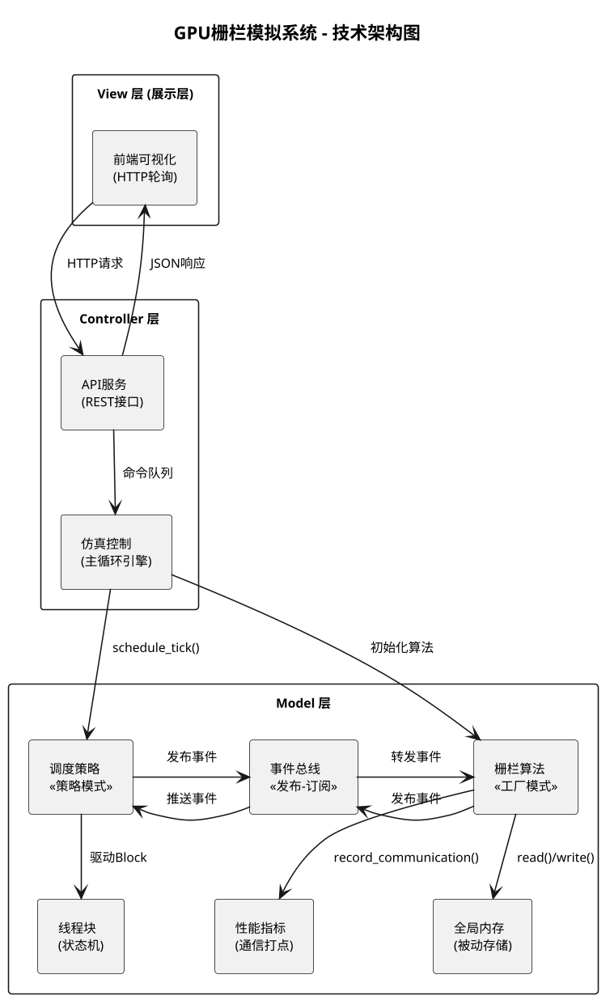
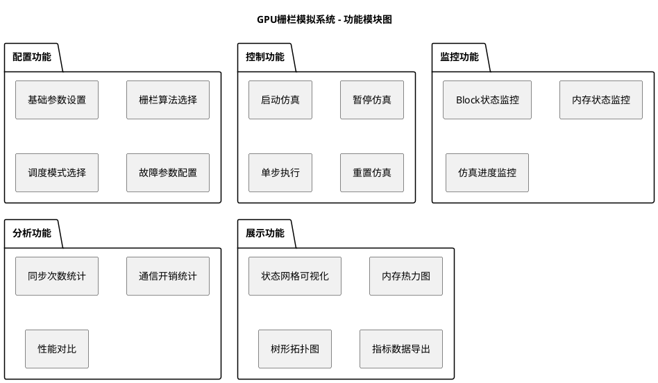
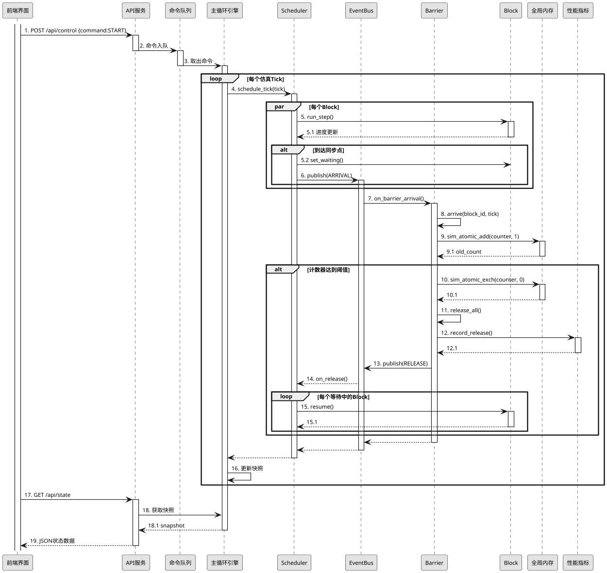
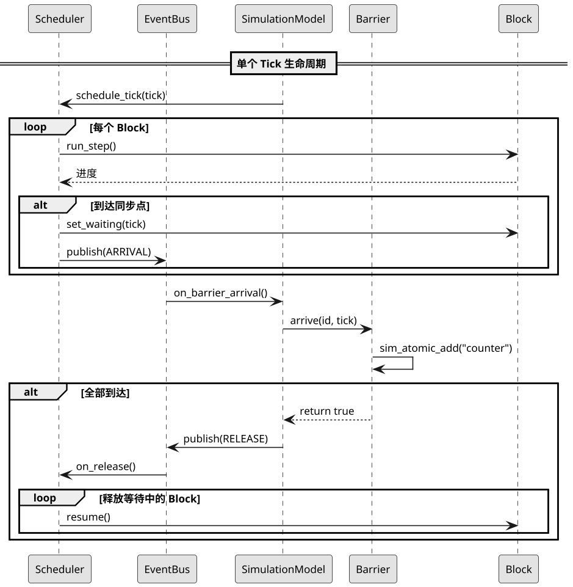
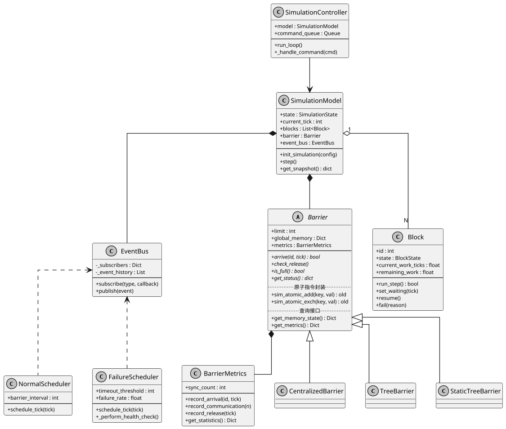
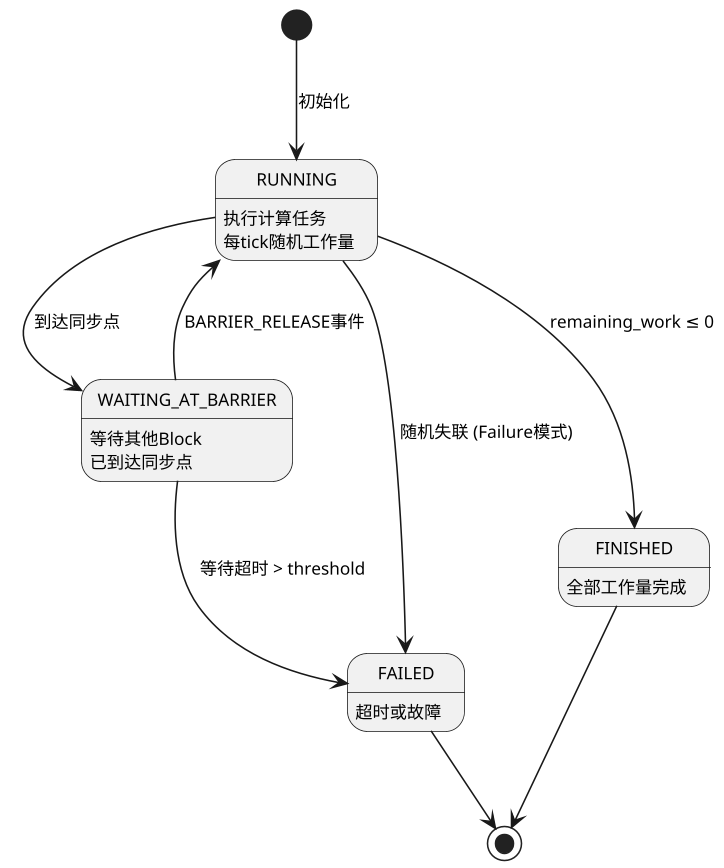
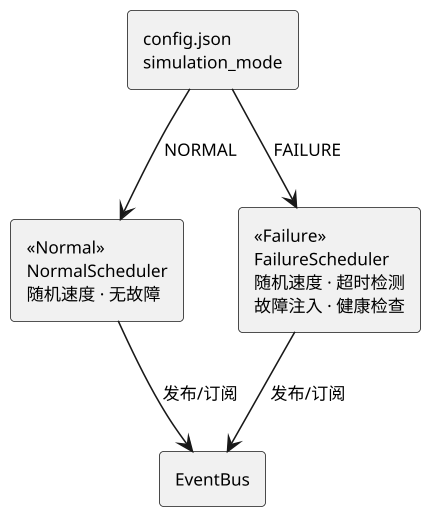
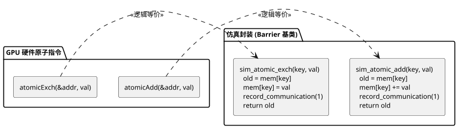
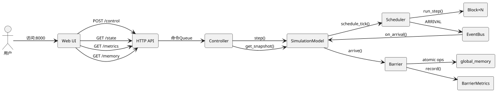
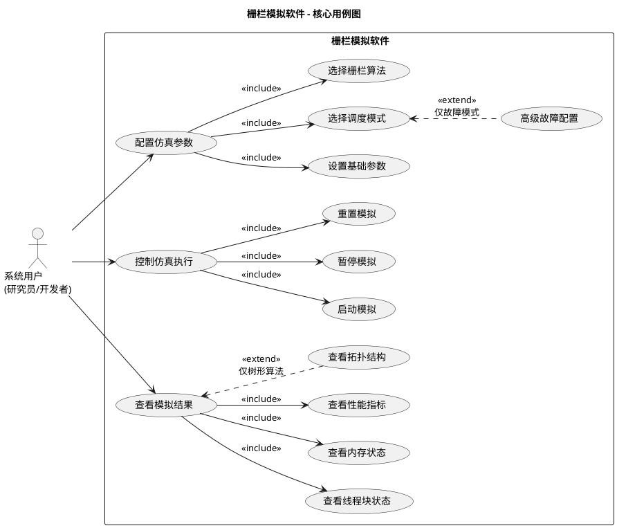

# 系统架构设计文档 (System Architecture Design)

> 本文档描述 GPU 栅栏模拟系统的完整架构设计。所有 UML 图表采用 PlantUML 语法，已针对 **A4 黑白打印** 优化。

---

## 一、技术架构图 (Technical Architecture)

> 系统采用 MVC 三层架构。View 层通过 HTTP 轮询获取状态，Controller 层通过命令队列驱动主循环，Model 层内部以 EventBus 实现组件间的发布-订阅解耦。在最新的重构中，全局内存 (`GlobalMemory`) 已从栅栏算法中剥离为独立模块，仅作为被动存储介质供栅栏算法通过原子指令进行读写。



### 架构解读

| 层级 | 核心职责 | 技术选型 | 设计模式 |
|------|---------|---------|---------|
| View | 用户交互、可视化 | HTML/CSS/JS + HTTP轮询 | — |
| Controller | 请求路由、主循环调度 | Python单线程 + 命令队列 | — |
| Model | 仿真逻辑、事件协调 | EventBus | 发布-订阅 |
| Scheduler | Block调度策略 | Normal/FailureScheduler | 策略模式 |
| Barrier | 同步算法 + 原子指令 | Centralized/Tree/StaticTree | 工厂模式 |
| GlobalMemory | 被动存储介质 | Dict封装 (read/write) | — |
| Block | 执行单元状态 | 状态机 | — |

**关键设计决策**：
- Controller 通过**命令队列**将 API 请求异步传递给主循环，避免多线程竞争。
- Model 内部通过 **EventBus** 实现 Scheduler 与 Barrier 完全解耦。
- **GlobalMemory 独立解耦**：全局内存从 Barrier 基类中剥离为独立模块，仅提供 `read()` / `write()` / `get_snapshot()` 三个纯访存接口。原子指令仍由 Barrier（代表 SM）发起，内部调用 GlobalMemory 的接口完成"读-改-写"操作。
- 前端采用 **HTTP 轮询**获取实时状态。

---

## 二、功能模块图 (Functional Modules)

展示系统提供的功能集合，从用户视角描述系统能力。



| 功能域 | 核心功能 | 对应实现 |
|--------|---------|---------|
| 配置 | 设置Block数量、选择栅栏算法、选择调度模式、配置故障参数 | 前端配置面板 -> Controller |
| 控制 | 启动/暂停/单步/重置仿真 | 前端按钮 -> API /control |
| 监控 | 实时Block状态、内存状态、仿真进度 | 前端轮询 -> API /state |
| 分析 | 同步/通信统计、性能对比 | BarrierMetrics -> API /metrics |
| 展示 | 网格/热力图/拓扑图可视化 | 前端渲染 -> API 数据 |

---

## 三、模块级交互时序图 (Module Interaction Sequence)

展示一个完整仿真周期内各模块之间的调用顺序与数据流向。



| 阶段 | 步骤 | 核心操作 | 目的 |
|------|------|---------|------|
| 初始化 | 1-3 | 命令入队取出 | 用户启动仿真 |
| Tick执行 | 4-5 | Scheduler驱动Block | 推进仿真时间 |
| 到达同步 | 6 | 发布ARRIVAL事件 | 通知Barrier |
| 栅栏处理 | 7-10 | 原子操作计数 | 模拟硬件同步 |
| 释放唤醒 | 11-15 | 发布RELEASE事件 | 恢复Block执行 |
| 状态查询 | 16-19 | 快照更新轮询 | 前端数据展示 |

---

## 四、事件驱动通信流程 (Event-Driven Communication)



### 事件类型

| 事件              | 发布者           | 订阅者    | 触发时机                     |
| ----------------- | ---------------- | --------- | ---------------------------- |
| `BARRIER_ARRIVAL` | Scheduler        | Model     | Block 进度跨过 interval 倍数 |
| `BARRIER_RELEASE` | Model            | Scheduler | 全部 Block 到达栅栏          |
| `BLOCK_FAILURE`   | FailureScheduler | —         | 超时或随机故障               |

---

## 三、核心类图 (Class Diagram)



---

## 四、线程块状态机 (Block State Machine)



| 状态                 | 含义     | 前端标记 | 触发条件             |
| -------------------- | -------- | -------- | -------------------- |
| `RUNNING`            | 执行计算 | 实心圆   | 初始 / 栅栏释放后    |
| `WAITING_AT_BARRIER` | 等待同步 | 斜线填充 | 进度达 interval 倍数 |
| `FINISHED`           | 完成     | 空心圆   | `remaining_work ≤ 0` |
| `FAILED`             | 故障     | 叉号标记 | 仅 Failure 模式      |

---

## 六、仿真模式选择 (Simulation Modes)



| 模式           | Block 速度 | 故障               | 场景         |
| -------------- | ---------- | ------------------ | ------------ |
| **NORMAL**     | 随机波动   | 无                 | 日常演示     |
| **FAILURE**    | 随机波动   | 超时+失联+健康检查 | 容错测试     |

---

## 七、原子指令封装 (Simulated Atomic Instructions)

`Barrier` 基类封装了两个模拟 GPU 硬件原子指令的方法，在逻辑模型上严格对应 GPU 的 **读-改-写** 不可分割操作。



**用法 (CentralizedBarrier)**:
```python
def arrive(self, block_id, tick):
    old = self.sim_atomic_add("counter", 1)   # CUDA: atomicAdd(&counter, 1)

def release_all(self, tick):
    self.sim_atomic_exch("counter", 0)         # CUDA: atomicExch(&counter, 0)
    self.sim_atomic_exch("sense", new_sense)   # CUDA: atomicExch(&sense, val)
```

---

## 八、数据流概览 (Data Flow)



---

## 九、目录结构

```
GPU_barrier_similation/
├── config/default_scenario.json     ← 仿真参数配置
├── src/
│   ├── main.py                      ← 入口
│   ├── controller/
│   │   └── simulation_controller.py ← API + 主循环
│   ├── model/
│   │   ├── simulation_model.py      ← 仿真协调器
│   │   ├── block.py                 ← 线程块
│   │   ├── barrier.py               ← 栅栏基类 + 原子指令
│   │   ├── barrier_metrics.py       ← 指标收集
│   │   ├── event_bus.py             ← 事件总线
│   │   ├── barriers/                ← 4种栅栏算法
│   │   └── schedulers/              ← 3种调度器
│   ├── view/console_view.py         ← 控制台输出
│   └── web/                         ← Web 前端
├── tests/                           ← 集成测试
└── docs/                            ← 文档
```
## 十、系统用例图 (Use Case Diagram)



### 用例图逻辑说明与需求分析

有别于对既有功能的简单描述，以下基于系统用例图，从**需求工程 (Requirement Engineering)** 视角剖析研究员或开发者对目标软件的实际诉求与需要解决的核心痛点。

#### 1. 实验控制变量的干预需求 (Configuration Requirements)
为了确保仿真环境能逼真还原真实的 GPU 软硬件环境并具备完备的科学对照性，系统必须满足用户全方位干预实验变量的诉求：
*   **基础环境拟真诉求 (`<<include>>` 设置基础参数)**：系统必须能够让研究员自由设定参与并行计算的规模 (Block数目) 与模拟计算周期的基准长度。更关键的是，为打破理想化模型，系统必须提供“负载波动参数 (Workload Variance)”供用户注入，以复刻 GPU 硬件层面的调度非一致性。
*   **鲁棒性极限测试诉求 (`<<include>>` 选择调度模式 -> `<<extend>>` 高级故障配置)**：在正常的性能对比外，研究员迫切需要评估特定同步算法在部分节点失联、超时等极端环境下的抗死锁能力。因此系统必须支持开启“故障容错模式”，且在该触发路径下游，系统被要求提供精细化的故障注入手段（如故障率、判死阈值调节）。
*   **多样化算法适配诉求 (`<<include>>` 选择栅栏算法)**：系统必须内置学术界最具代表性的几种核心同步理念（高争用/集中式、分摊争用/树形），研究人员需要能自由切换以此为对照核心组进行深入调研。

#### 2. 黑盒过程的强干预与掌控需求 (Execution Control Requirements)
传统的并行环境通常是黑盒甚至难以调试的，在此仿真软件中，研究人员的核心诉求是“时空主宰能力”：
*   **瞬态定格与排错诉求**：研究进程中，当某一线程块发生意料之外的“等待停滞”时，用户必须能够瞬间“暂停”全局滴答逻辑此时钟 (Tick)，定格所有底层并发内存快照便于人工推演排查。
*   **重现与复位诉求**：实验环境因失控、死锁或简单跑完后，系统必须支持极其轻量的状态一键“重置”，无需重启整个平台容器，瞬间清空残余快照等待新一次的下发指令。

#### 3. 可视化洞察与性能论证需求 (Validation & Monitoring Requirements)
让复杂的并发时序转化为直观的图表是该系统最为核心的交付物。系统必须提供“多维度、细粒度”的观测探针：
*   **宏观与微观生命周期跟踪**：无论是哪个算法，研究人员都需要一目了然地确诊每一个单独的 Block 目前究竟处于生命周期的哪一状态节点（在跑、在挂起、亦或是超时挂掉）。
*   **瓶颈透视与热点诊断诉求**：解决锁争用的前提是能看见争用。系统被强势要求将隐藏的“全局统一内存池”进行降维展示，通过颜色深度的“热图”机制直观反映出各个存储通信单元在此次同步中承受了多少的通信频次。
*   **定量性能论证诉求**：图表之外，系统必须要能给出冷冰冰但极具公信力的 KPI 数据总结，即给出总通信开销次数和造成的总同步延迟滴答数，用以直接作为毕业论文/研究结论的定量支撑物。
*   **逻辑结构校验诉求 (`<<extend>>` 查看拓扑结构)**：在对 Tree 或 Static Tree 这类分层算法进行研究和改良时，系统有责任展开该算法生成的黑盒抽象树形父子节点图，帮助开发者验证其在算法层面编写的合并策略与下发广播路径是否建立的完美无误。
