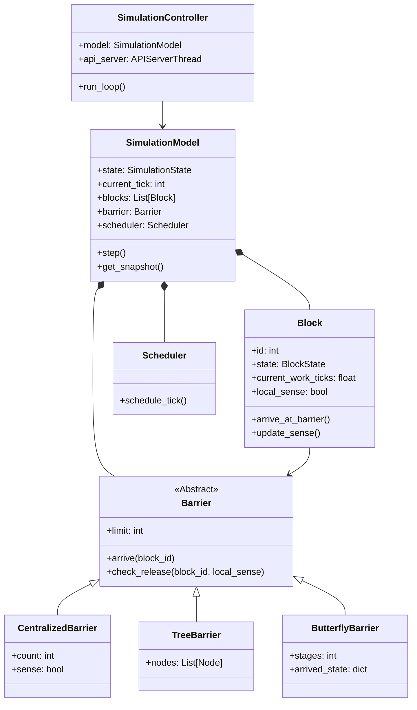

# GPU 栅栏模拟系统 (GPU Barrier Simulation) 技术文档

> [!IMPORTANT]
> 本文档旨在提供系统的完整技术细节，包括架构设计、核心算法、配置说明及开发指南，以防止后续开发中遗忘关键细节。

## 1. 系统概览 (System Overview)

本项目旨在模拟 GPU 内部的 **栅栏同步 (Barrier Synchronization)** 机制。通过软件模拟的方式，展示线程块 (Thread Blocks) 之间的并行执行与同步过程，便于研究不同的同步策略（如集中式、树形、蝴蝶形等）。

系统采用经典的 **MVC (Model-View-Controller)** 架构：
- **Model (模型层)**: 负责核心仿真逻辑、状态维护、调度算法与同步机制。
- **View (视图层)**: 负责将仿真状态实时渲染给用户（目前支持控制台视图）。
- **Controller (控制层)**: 负责协调模型与视图，处理配置加载、主循环控制与日志记录。

## 1.1 系统类图 (Class Diagram)



## 2. 目录结构 (Directory Structure)

```text
gpu_barrier_sim/
├── config/                  # 配置文件目录
│   └── default_scenario.json # 默认场景配置
├── src/                     # 源代码目录
│   ├── main.py              # 程序入口
│   ├── controller/          # 控制层
│   │   └── simulation_controller.py
│   ├── model/               # 模型层 (核心逻辑)
│   │   ├── simulation_model.py # 仿真环境主模型
│   │   ├── block.py            # 线程块实体
│   │   ├── barrier.py          # 栅栏同步原语
│   │   └── scheduler.py        # 调度器
│   ├── view/                # 视图层
│   │   └── console_view.py     # 控制台显示
│   ├── web/                 # [NEW] Web 前端资源
│   │   ├── index.html
│   │   ├── styles.css
│   │   └── app.js
│   └── utils/               # 工具模块
│       └── logger.py           # 日志记录器
├── system_design_docs.md    # 系统设计文档 (Mermaid 图表)
└── trace.log                # 仿真运行日志 (运行时生成)
```

## 3. 核心组件详解 (Core Components)

### 3.1 Model 层

#### SimulationModel (`src/model/simulation_model.py`)
整个仿真环境的容器。
- **职责**: 管理全局生命周期状态 (`STOPPED`, `RUNNING`, `PAUSED`, `COMPLETED`)，持有 `Scheduler`, `GlobalBarrier` 和 `Block` 列表。
- **关键方法**:
    - `step()`: 执行单步仿真，驱动调度器并更新状态。
    - `get_snapshot()`: 生成当前帧的完整状态快照，供 View 渲染。

#### Block (`src/model/block.py`)
代表 GPU 中的一个线程块 (Thread Block)。
- **状态**: `RUNNING` (运行中), `WAITING_AT_BARRIER` (等待同步), `FINISHED` (完成)。
- **关键属性**:
    - `current_work_ticks`: 当前已执行的工作量。
    - `local_sense`: 本地维护的栅栏“感知”位，用于检测全局栅栏是否翻转。
    - `speed_factor`: 执行速度因子 (默认 1.0)。初始化时根据配置的 `workload_variance` 在 `[1.0-var, 1.0+var]` 范围内随机生成，模拟 GPU 负载不均衡。
- **关键机制**:
    - **Sense-Reversing (感知反转)**: Block 在等待时，对比 `local_sense` 与全局 `barrier.sense`。如果不一致，说明栅栏已释放，Block 自动苏醒。

#### GlobalBarrier (`src/model/barrier.py`)
实现集中式栅栏同步逻辑。
- **机制**: 采用 **Sense-Reversing** 算法避免计数器重置竞态。
- **逻辑**:
    - 维护 `count` (当前到达数) 和 `limit` (阈值)。
    - 当 `count == limit` 时，翻转全局 `sense` 变量，重置 `count`。
    - 等待中的 Block 检测到 `sense` 变化后继续执行。

#### Scheduler (`src/model/scheduler.py`)
仿真调度器。
- **职责**: 在每个 Tick (时钟步) 中遍历所有 Block，调用其 `run_step()`。
- **同步触发**: 模拟简单的同步点逻辑，当 Block 的工作量达到 `barrier_interval` 的倍数时，触发 `arrive_at_barrier()`。
- **异常检测**: 实现了 `_detect_deadlock()` 方法，用于检测“全员等待但栅栏未释放”的潜在死锁状态，并记录警告日志 (`WARNING_POTENTIAL_DEADLOCK`)。

### 3.2 Controller 层

#### SimulationController (`src/controller/simulation_controller.py`)
系统的“大脑”。
- **初始化**: 加载 `default_scenario.json` 配置。
- **主循环**:
    1. 调用 `model.step()` 更新状态。
    2. 获取 `snapshot`。
    3. 调用 `view.render(snapshot)` 更新显示。
    4. 记录日志到 `trace.log`。
    5. 控制帧率 (Sleep)。

### 3.3 View 层

#### ConsoleView (`src/view/console_view.py`)
基于文本的简易可视化。
- **输出**: 实时打印当前 Tick、栅栏状态 (Count/Limit) 以及每个 Block 的状态符号 (`.`运行, `#`等待, `F`完成)。

#### Web View (`src/web/`)
基于 HTML5/JS 的图形化前端。
- **架构**: 单页应用 (SPA)，通过 `fetch` API 轮询 `/api/state` 获取状态。
- **功能**:
    - **Grid Visualization**: 使用网格和颜色直观展示 Block 状态 (Running/Waiting/Finished) 及进度条。
    - **Interactive Control**: 右侧边栏提供 Start/Pause/Step/Reset 按钮及参数配置。
- **部署**: 由 `SimulationController` 内置的 HTTP Server 直接服务静态文件，访问 `http://localhost:8000/` 即可使用。

### 3.4 Utils

#### SimulationLogger (`src/utils/logger.py`)
- **格式**: JSON Lines (NDJSON)。
- **用途**: 记录仿真过程中的关键事件（到达栅栏、释放、完成等），便于后续分析或回放。

## 4. 关键数据结构 (Key Data Structures)

### 4.1 状态快照 (Snapshot)
`SimulationModel.get_snapshot()` 返回的字典，包含一帧的所有信息：
```json
{
    "tick": 123,
    "simulation_state": "RUNNING",
    "blocks": [
        { "id": 0, "state": "RUNNING", "progress": 45.2, "at_barrier": false },
        { "id": 1, "state": "WAITING_AT_BARRIER", "progress": 50.0, "at_barrier": true }
    ],
    "barrier": {
        "active": true,
        "count": 1,
        "limit": 8,
        "sense": 0,
        "is_released": false
    }
}
```

### 4.2 配置文件 (`config/default_scenario.json`)
```json
{
  "simulation_name": "Demo_Scenario_1",
  "settings": {
    "num_blocks": 8,           // 线程块数量
    "barrier_type": "CENTRALIZED", // 栅栏类型 (目前仅实现集中式)
    "time_slice_ms": 100,      // (预留) 时间片参数
    "max_ticks": 10000,        // 最大仿真时长
    "barrier_interval": 100    // 每个 Block 每隔多少 tick 触发一次同步
  },
  "behavior_profile": {
    "workload_variance": 0.2,  // (内部使用) 执行速度波动方差
    "failure_rate": 0.0        // (预留) 模拟故障率
  }
}
```

## 5. 开发与扩展指南 (Development Guide)

### 5.1 添加新的栅栏类型
1. 在 `src/model/` 下创建新的栅栏类（例如 `tree_barrier.py`）。
2. 让其实现类似 `GlobalBarrier` 的接口 (`arrive`, `is_full` 等)。
3. 在 `SimulationModel` 初始化时，根据配置文件的 `barrier_type` 字段选择实例化对应的栅栏类。

### 5.2 对接前端可视化
目前 `SimulationController` 将 `snapshot` 传递给 `ConsoleView`。
若要对接 Web 前端：
1. 创建 `WebView` 类，实现 `render(snapshot)` 方法。
2. 在 `render` 中将 snapshot 序列化为 JSON，通过 WebSocket 或 HTTP 发送给前端。
3. 在 `main.py` 中将 `ConsoleView` 替换为 `WebView`。

## 6. 使用说明 (Usage)

1. **配置场景**: 修改 `config/default_scenario.json` 中的参数。
2. **运行仿真**:
   ```bash
   python src/main.py
   ```
3. **查看结果**:
   - 屏幕将实时输出仿真进度。
   - 运行结束后，查看 `trace.log` 获取详细的事件记录。

> [!TIP]
> 可以在 `src/model/block.py` 中调整 `speed_factor` 的随机范围，来观察不同负载不均衡度对栅栏同步效率的影响。
